# BUILD_30: Database Design - Identity Module (Code-First - Multi-Group Support)

> 📚 [Quay lại Mục lục](BUILD_INDEX.md)  
> 📋 **Prerequisites:** BUILD_03B (Identity ERD Simplified) đã complete  
> 🎯 **Approach:** Code-First với EF Core  
> 🆕 **Update:** Support **1 User = Many Groups** (Many-to-Many relationship)  
> ⚠️ **Important:** UserUserGroups is a **pure junction table** - NO audit fields

Tài liệu này hướng dẫn **thiết kế database chi tiết cho Identity Module** với **Multi-Group Support** - Mỗi user có thể thuộc nhiều groups.

---

## 1. Overview

**Làm gì:** Thiết kế và implement Identity Module database với **Many-to-Many User ↔ UserGroup** relationship.

**Key Change:** ⭐
```
OLD Design: AspNetUsers.UserGroupId (1 user = 1 group)
NEW Design: UserUserGroups junction table (1 user = many groups)
```

**Database Schema Summary:**
```
14 Tables (thêm 1 table mới):
├── UserGroups (Custom)
├── UserUserGroups (Custom - NEW: Pure junction table) ⭐
├── UserGroupPermissions (Custom)
├── AspNetUsers (NO UserGroupId column) ⭐
├── AspNetRoles (Extended)
├── AspNetUserRoles, AspNetUserClaims, AspNetRoleClaims, 
│   AspNetUserLogins, AspNetUserTokens (Built-in)
├── Actions (Custom)
├── Functions (Custom)
├── Permissions (Custom)
└── RolePermissions (Custom)
```

**Junction Table Design Philosophy:**
- ✅ **Pure junction tables** (no extra metadata) → Use **Composite Primary Key**
- ✅ **NO AssignedOn, AssignedBy** - Keep it simple
- ✅ Prevents duplicate entries automatically
- ✅ Better performance (smaller table, smaller indexes)

---

## 1.1. Entity Relationship Diagram (ERD)

```mermaid
---
config:
  theme: neo-dark
---
erDiagram
    
    UserGroups {
   nvarchar_450 Id PK "GUID"
  nvarchar_100 Name UK "VIP, Staff, Manager, Wholesale"
    nvarchar_500 Description "Group purpose"
    }
    
  UserUserGroups {
      nvarchar_450 UserId PK "Composite PK - User reference"
   nvarchar_450 UserGroupId PK "Composite PK - Group reference"
    }
    
    UserGroupPermissions {
   nvarchar_450 Id PK "GUID"
        nvarchar_450 UserGroupId FK "Group reference"
        nvarchar_450 PermissionId FK "Permission reference"
    }
 
    AspNetUsers {
   nvarchar_450 Id PK "GUID"
 nvarchar_256 UserName UK "Unique username"
   nvarchar_256 NormalizedUserName UK "Indexed"
nvarchar_256 Email "Email address"
 nvarchar_256 NormalizedEmail UK "Indexed"
 bit EmailConfirmed "Default: 0"
  nvarchar_max PasswordHash "Hashed password"
      nvarchar_max SecurityStamp "Security token"
        nvarchar_max ConcurrencyStamp "Concurrency"
 nvarchar_max PhoneNumber "Phone"
 bit PhoneNumberConfirmed "Default: 0"
        bit TwoFactorEnabled "2FA flag"
datetimeoffset LockoutEnd "Lockout expiry"
    bit LockoutEnabled "Can be locked"
     int AccessFailedCount "Failed login attempts"
  nvarchar_100 FirstName "Custom field"
    nvarchar_100 LastName "Custom field"
   nvarchar_500 ImageUrl "Profile image"
   bit IsActive "Account status"
  nvarchar_max RefreshToken "JWT refresh token"
    datetime2 RefreshTokenExpiryTime "Token expiry"
        nvarchar_256 ObjectId "Azure AD ID"
    }
    
    AspNetRoles {
    nvarchar_450 Id PK "GUID"
        nvarchar_256 Name UK "Role name"
        nvarchar_256 NormalizedName UK "Indexed"
   nvarchar_max ConcurrencyStamp "Concurrency"
        nvarchar_500 Description "Custom field"
     bit IsDefault "Default role on register"
    bit IsStatic "System role, cannot delete"
    }
    
    AspNetUserRoles {
        nvarchar_450 UserId PK "Composite Key"
 nvarchar_450 RoleId PK "Composite Key"
    }
    
    AspNetUserClaims {
      int Id PK "Identity"
   nvarchar_450 UserId FK "User reference"
        nvarchar_max ClaimType "e.g., Permission, fullName"
        nvarchar_max ClaimValue "e.g., Users.View"
    }
  
    AspNetRoleClaims {
   int Id PK "Identity"
        nvarchar_450 RoleId FK "Role reference"
nvarchar_max ClaimType "Claim type"
        nvarchar_max ClaimValue "Claim value"
    }

    AspNetUserLogins {
        nvarchar_128 LoginProvider PK "e.g., Google, Facebook"
        nvarchar_128 ProviderKey PK "External user ID"
        nvarchar_max ProviderDisplayName "Display name"
 nvarchar_450 UserId FK "User reference"
    }
 
    AspNetUserTokens {
   nvarchar_450 UserId PK "User reference"
      nvarchar_128 LoginProvider PK "Token provider"
        nvarchar_128 Name PK "Token name"
      nvarchar_max Value "Token value"
    }

    Actions {
  nvarchar_450 Id PK "GUID"
    nvarchar_50 Name UK "View, Create, Update, Delete"
 nvarchar_100 DisplayName "Localized name"
  int SortOrder "Display order"
        bit IsActive "Default: 1"
    }
    
    Functions {
     nvarchar_450 Id PK "GUID"
        nvarchar_100 Name UK "Users, Products, Orders"
        nvarchar_200 DisplayName "Localized name"
nvarchar_450 ParentId FK "Hierarchical parent"
        int SortOrder "Display order"
nvarchar_500 Url "Menu URL"
        nvarchar_100 Icon "Icon class"
      bit IsActive "Default: 1"
    }
 
    Permissions {
      nvarchar_450 Id PK "GUID"
  nvarchar_450 FunctionId FK "Function reference"
        nvarchar_450 ActionId FK "Action reference"
 nvarchar_200 Name UK "Function.Action format"
        nvarchar_300 DisplayName "Localized name"
      bit IsActive "Default: 1"
    }
  
    RolePermissions {
        nvarchar_450 Id PK "GUID"
        nvarchar_450 RoleId FK "Role reference"
  nvarchar_450 PermissionId FK "Permission reference"
  }
    
    AspNetUsers ||--o{ AspNetUserRoles : assigned
    AspNetRoles ||--o{ AspNetUserRoles : contains
    AspNetRoles ||--o{ AspNetRoleClaims : has
    AspNetUsers ||--o{ AspNetUserClaims : has
    AspNetUsers ||--o{ AspNetUserLogins : uses
    AspNetUsers ||--o{ AspNetUserTokens : has
    Functions ||--o{ Permissions : contains
    Actions ||--o{ Permissions : contains
    AspNetRoles ||--o{ RolePermissions : assigned
    Permissions ||--o{ RolePermissions : granted
    UserGroups ||--o{ UserUserGroups : contains
    AspNetUsers ||--o{ UserUserGroups : member
    UserGroups ||--o{ UserGroupPermissions : has
    Permissions ||--o{ UserGroupPermissions : granted
```



**Key Relationships:**
- ✅ **AspNetUsers ↔ UserGroups**: Many-to-Many via UserUserGroups **(Composite PK)** ⭐
- ✅ **UserGroups ↔ Permissions**: Many-to-Many via UserGroupPermissions
- ✅ **AspNetUsers ↔ AspNetRoles**: Many-to-Many via AspNetUserRoles
- ✅ **AspNetRoles ↔ Permissions**: Many-to-Many via RolePermissions
- ✅ **Functions ↔ Actions**: Many-to-Many via Permissions

---

## 2. Key Entity Changes

### **2.1. UserUserGroup Entity** ⭐ (NEW - Pure Junction Table)

**File:** `src/Core/Domain/Identity/UserUserGroup.cs`

```csharp
using Microsoft.EntityFrameworkCore;

namespace ECO.WebApi.Domain.Identity;

/// <summary>
/// Junction table: User ↔ UserGroup (Many-to-Many)
/// Allows 1 user to belong to multiple groups
/// Uses COMPOSITE PRIMARY KEY (UserId, UserGroupId) - NO surrogate Id
/// NO audit fields (AssignedOn, AssignedBy) - Keep it simple
/// </summary>
[PrimaryKey(nameof(UserId), nameof(UserGroupId))]
public sealed class UserUserGroup
{
    /// <summary>
    /// User ID (Part of composite key)
    /// </summary>
    public Guid UserId { get; private set; }

    /// <summary>
    /// User group ID (Part of composite key)
    /// </summary>
    public Guid UserGroupId { get; private set; }

    // ==================== Navigation Properties ====================
  
    /// <summary>
    /// User reference
    /// </summary>
    public ApplicationUser User { get; private set; } = default!;

    /// <summary>
    /// User group reference
    /// </summary>
  public UserGroup UserGroup { get; private set; } = default!;

    // ==================== Constructors ====================

    // EF Core constructor
    private UserUserGroup() { }

    // ==================== Factory Methods ====================
    
    /// <summary>
    /// Assign user to user group
    /// </summary>
    public static UserUserGroup Create(Guid userId, Guid userGroupId)
    {
     if (userId == Guid.Empty)
         throw new ArgumentException("UserId cannot be empty", nameof(userId));

        if (userGroupId == Guid.Empty)
    throw new ArgumentException("UserGroupId cannot be empty", nameof(userGroupId));

    return new UserUserGroup
      {
    UserId = userId,
 UserGroupId = userGroupId
    };
    }
}
```

**Key Points:**
- ✅ **Composite Primary Key:** `(UserId, UserGroupId)` prevents duplicates automatically
- ✅ **NO AssignedOn, AssignedBy:** Pure junction table, no audit metadata
- ✅ **Simpler:** Less complexity, better performance
- ✅ **Natural Key:** Semantic meaning

**Why NO audit fields?**
- ❌ **Audit trail not critical for group membership** (can be tracked at application level if needed)
- ❌ **Adds unnecessary complexity** (extra columns, indexes)
- ❌ **Performance impact** (larger table, slower queries)
- ✅ **Keep junction tables pure** (best practice for Many-to-Many)

---

### **2.2. UserGroup Entity (Updated)**

**File:** `src/Core/Domain/Identity/UserGroup.cs`

```csharp
using System.ComponentModel.DataAnnotations;

namespace ECO.WebApi.Domain.Identity;

/// <summary>
/// User group for authorization purposes only
/// Supports Many-to-Many with Users via UserUserGroups
/// </summary>
public sealed class UserGroup
{
    /// <summary>
    /// Group ID (Primary Key)
    /// </summary>
    public Guid Id { get; private set; }

/// <summary>
    /// Group name (Unique)
    /// Examples: "VIP", "Staff", "Manager", "Wholesale", "Retail"
    /// </summary>
    [Required]
    [MaxLength(100)]
    public string Name { get; private set; } = default!;

  /// <summary>
    /// Group description/purpose
    /// </summary>
    [MaxLength(500)]
    public string? Description { get; private set; }

    // ==================== Navigation Properties ====================
    
    /// <summary>
    /// User assignments (via UserUserGroups junction table)
    /// </summary>
    public ICollection<UserUserGroup> UserAssignments { get; private set; } = new List<UserUserGroup>();

    /// <summary>
    /// Permissions assigned to this group
 /// </summary>
    public ICollection<UserGroupPermission> Permissions { get; private set; } = new List<UserGroupPermission>();

    // ==================== Constructors ====================

    // EF Core constructor
    private UserGroup() { }

    // ==================== Factory Methods ====================
    
 /// <summary>
  /// Create new user group
    /// </summary>
    public static UserGroup Create(string name, string? description = null)
    {
    if (string.IsNullOrWhiteSpace(name))
    throw new ArgumentException("Group name is required", nameof(name));

        if (name.Length > 100)
       throw new ArgumentException("Group name must be <= 100 characters", nameof(name));

  return new UserGroup
    {
            Id = Guid.NewGuid(),
     Name = name.Trim(),
    Description = description?.Trim()
 };
    }

    // ==================== Business Methods ====================
  
  /// <summary>
    /// Update group details
    /// </summary>
    public void UpdateDetails(string name, string? description)
    {
 if (string.IsNullOrWhiteSpace(name))
   throw new ArgumentException("Group name is required", nameof(name));

        if (name.Length > 100)
  throw new ArgumentException("Group name must be <= 100 characters", nameof(name));

        Name = name.Trim();
        Description = description?.Trim();
    }

    /// <summary>
    /// Assign user to this group
  /// </summary>
    public void AssignUser(Guid userId)
    {
        // Check if user already in group
        if (UserAssignments.Any(ua => ua.UserId == userId))
      return; // Already assigned

        var assignment = UserUserGroup.Create(userId, Id);
    UserAssignments.Add(assignment);
  }

    /// <summary>
    /// Remove user from this group
    /// </summary>
    public void RemoveUser(Guid userId)
    {
 var assignment = UserAssignments.FirstOrDefault(ua => ua.UserId == userId);
        if (assignment != null)
 {
  UserAssignments.Remove(assignment);
        }
    }

  /// <summary>
    /// Assign permission to group
    /// </summary>
    public void AssignPermission(Guid permissionId)
    {
      if (Permissions.Any(p => p.PermissionId == permissionId))
   return; // Already assigned

      var userGroupPermission = UserGroupPermission.Create(Id, permissionId);
  Permissions.Add(userGroupPermission);
    }

  /// <summary>
    /// Remove permission from group
 /// </summary>
 public void RemovePermission(Guid permissionId)
{
    var permission = Permissions.FirstOrDefault(p => p.PermissionId == permissionId);
  if (permission != null)
        {
            Permissions.Remove(permission);
        }
    }

    /// <summary>
 /// Get all users in this group
    /// </summary>
    public IEnumerable<Guid> GetUserIds() => UserAssignments.Select(ua => ua.UserId);
}
```

**Key Changes:**
- ✅ Changed `Users` navigation to `UserAssignments` (via junction table)
- ✅ `AssignUser()` method **NO assignedBy parameter** (simplified)
- ✅ Added `RemoveUser()` method
- ✅ Added `GetUserIds()` helper method

---

### **2.3. ApplicationUser Entity (Updated)**

**File:** `src/Core/Domain/Identity/ApplicationUser.cs`

```csharp
using Microsoft.AspNetCore.Identity;

namespace ECO.WebApi.Domain.Identity;

/// <summary>
/// Extended IdentityUser with custom fields
/// Supports Many-to-Many with UserGroups
/// </summary>
public class ApplicationUser : IdentityUser<Guid>
{
 // Custom fields
    public string? FirstName { get; set; }
    public string? LastName { get; set; }
    public string? ImageUrl { get; set; }
    public bool IsActive { get; set; } = true;
    public string? RefreshToken { get; set; }
  public DateTime? RefreshTokenExpiryTime { get; set; }
    public string? ObjectId { get; set; } // Azure AD

    // ==================== Navigation Properties ====================
    
    /// <summary>
 /// User group assignments (via UserUserGroups junction table)
    /// </summary>
    public ICollection<UserUserGroup> GroupAssignments { get; set; } = new List<UserUserGroup>();

    /// <summary>
    /// User roles
    /// </summary>
    public ICollection<IdentityUserRole<Guid>> UserRoles { get; set; } = new List<IdentityUserRole<Guid>>();

    /// <summary>
    /// User claims
  /// </summary>
public ICollection<IdentityUserClaim<Guid>> Claims { get; set; } = new List<IdentityUserClaim<Guid>>();

    /// <summary>
    /// External logins
    /// </summary>
    public ICollection<IdentityUserLogin<Guid>> Logins { get; set; } = new List<IdentityUserLogin<Guid>>();

    /// <summary>
    /// User tokens
    /// </summary>
    public ICollection<IdentityUserToken<Guid>> Tokens { get; set; } = new List<IdentityUserToken<Guid>>();

    // ==================== Helper Methods ====================
    
    /// <summary>
  /// Get full name
    /// </summary>
    public string GetFullName() => $"{FirstName} {LastName}".Trim();

    /// <summary>
/// Get all user group IDs
    /// </summary>
    public IEnumerable<Guid> GetUserGroupIds() => GroupAssignments.Select(ga => ga.UserGroupId);

    /// <summary>
    /// Check if user belongs to specific group
    /// </summary>
  public bool IsInGroup(Guid userGroupId) => GroupAssignments.Any(ga => ga.UserGroupId == userGroupId);

/// <summary>
    /// Check if user belongs to any of the specified groups
    /// </summary>
  public bool IsInAnyGroup(params Guid[] userGroupIds) => 
   GroupAssignments.Any(ga => userGroupIds.Contains(ga.UserGroupId));
}
```

**Key Changes:**
- ❌ **Removed:** `UserGroupId` property
- ❌ **Removed:** `UserGroup` navigation property
- ✅ **Added:** `GroupAssignments` navigation (Many-to-Many)
- ✅ **Added:** `GetUserGroupIds()`, `IsInGroup()`, `IsInAnyGroup()` helper methods

---

## 3. EF Core Configurations

### **3.1. UserUserGroupConfiguration** ⭐ (NEW)

**File:** `src/Infrastructure/Persistence/Configurations/Identity/UserUserGroupConfiguration.cs`

```csharp
using ECO.WebApi.Domain.Identity;
using Microsoft.EntityFrameworkCore;
using Microsoft.EntityFrameworkCore.Metadata.Builders;

namespace ECO.WebApi.Infrastructure.Persistence.Configurations.Identity;

/// <summary>
/// EF Core configuration for UserUserGroup junction table
/// Enables Many-to-Many relationship between User and UserGroup
/// Uses COMPOSITE PRIMARY KEY - NO surrogate Id, NO audit fields
/// </summary>
public class UserUserGroupConfiguration : IEntityTypeConfiguration<UserUserGroup>
{
    public void Configure(EntityTypeBuilder<UserUserGroup> builder)
    {
        // Table mapping
        builder.ToTable("UserUserGroups", "Identity");

        // ⭐ Composite Primary Key (configured via [PrimaryKey] attribute in entity)
        // No need to configure here

 // Properties
        builder.Property(uug => uug.UserId)
    .IsRequired();

   builder.Property(uug => uug.UserGroupId)
  .IsRequired();

      // Indexes for FK columns (improve query performance)
        builder.HasIndex(uug => uug.UserId)
  .HasDatabaseName("IX_UserUserGroups_UserId");

        builder.HasIndex(uug => uug.UserGroupId)
     .HasDatabaseName("IX_UserUserGroups_UserGroupId");

   // Relationships
 builder.HasOne(uug => uug.User)
          .WithMany(u => u.GroupAssignments)
            .HasForeignKey(uug => uug.UserId)
       .OnDelete(DeleteBehavior.Cascade); // Delete assignments when user deleted

        builder.HasOne(uug => uug.UserGroup)
  .WithMany(ug => ug.UserAssignments)
    .HasForeignKey(uug => uug.UserGroupId)
     .OnDelete(DeleteBehavior.Cascade); // Delete assignments when group deleted
    }
}
```

**Key Points:**
- ✅ **Composite Primary Key:** `(UserId, UserGroupId)` prevents duplicates
- ✅ **NO surrogate Id:** Cleaner, more semantic
- ✅ **NO AssignedOn, AssignedBy:** Pure junction table
- ✅ Cascade delete - assignments deleted when user or group deleted

---

### **3.2. UserGroupConfiguration (Updated)**

**File:** `src/Infrastructure/Persistence/Configurations/Identity/UserGroupConfiguration.cs`

```csharp
using ECO.WebApi.Domain.Identity;
using Microsoft.EntityFrameworkCore;
using Microsoft.EntityFrameworkCore.Metadata.Builders;

namespace ECO.WebApi.Infrastructure.Persistence.Configurations.Identity;

/// <summary>
/// EF Core configuration for UserGroup entity
/// </summary>
public class UserGroupConfiguration : IEntityTypeConfiguration<UserGroup>
{
    public void Configure(EntityTypeBuilder<UserGroup> builder)
    {
        // Table mapping
        builder.ToTable("UserGroups", "Identity");

   // Primary key
  builder.HasKey(ug => ug.Id);

        // Properties
   builder.Property(ug => ug.Name)
 .IsRequired()
  .HasMaxLength(100);

  builder.Property(ug => ug.Description)
       .HasMaxLength(500);

        // Unique constraint on Name
  builder.HasIndex(ug => ug.Name)
.IsUnique()
      .HasDatabaseName("IX_UserGroups_Name");

        // Relationships
   builder.HasMany(ug => ug.UserAssignments)
     .WithOne(uug => uug.UserGroup)
   .HasForeignKey(uug => uug.UserGroupId)
    .OnDelete(DeleteBehavior.Cascade);

    builder.HasMany(ug => ug.Permissions)
        .WithOne(ugp => ugp.UserGroup)
.HasForeignKey(ugp => ugp.UserGroupId)
      .OnDelete(DeleteBehavior.Cascade);
    }
}
```

**Key Changes:**
- ✅ Updated relationship: `UserAssignments` instead of `Users`
- ✅ Cascade delete - assignments deleted when group deleted

---

### **3.3. ApplicationUserConfiguration (Updated)**

**File:** `src/Infrastructure/Persistence/Configurations/Identity/ApplicationUserConfiguration.cs`

```csharp
using ECO.WebApi.Domain.Identity;
using Microsoft.EntityFrameworkCore;
using Microsoft.EntityFrameworkCore.Metadata.Builders;

namespace ECO.WebApi.Infrastructure.Persistence.Configurations.Identity;

/// <summary>
/// EF Core configuration for ApplicationUser (extended IdentityUser)
/// </summary>
public class ApplicationUserConfiguration : IEntityTypeConfiguration<ApplicationUser>
{
    public void Configure(EntityTypeBuilder<ApplicationUser> builder)
  {
     // Custom properties
        builder.Property(u => u.FirstName)
   .HasMaxLength(100);

    builder.Property(u => u.LastName)
   .HasMaxLength(100);

 builder.Property(u => u.ImageUrl)
          .HasMaxLength(500);

builder.Property(u => u.IsActive)
     .IsRequired()
            .HasDefaultValue(true);

  builder.Property(u => u.ObjectId)
            .HasMaxLength(256);

   // Relationships
      builder.HasMany(u => u.GroupAssignments)
       .WithOne(uug => uug.User)
     .HasForeignKey(uug => uug.UserId)
        .OnDelete(DeleteBehavior.Cascade);

        // Index on IsActive for filtering
  builder.HasIndex(u => u.IsActive)
   .HasDatabaseName("IX_AspNetUsers_IsActive");
    }
}
```

**Key Changes:**
- ❌ **Removed:** `UserGroupId` property configuration
- ❌ **Removed:** FK to UserGroups
- ✅ **Added:** Relationship to `GroupAssignments`

---

## 4. Seed Data Examples (Updated)

### **4.1. Seed UserUserGroups**

```csharp
private async Task SeedUserUserGroupsAsync()
{
    if (await _context.UserUserGroups.AnyAsync())
 {
        _logger.LogInformation("UserUserGroups already seeded, skipping...");
    return;
}

    _logger.LogInformation("Seeding UserUserGroups...");

    // Get groups
    var vipGroup = await _context.UserGroups.FirstAsync(ug => ug.Name == "VIP");
    var staffGroup = await _context.UserGroups.FirstAsync(ug => ug.Name == "Staff");
    var managerGroup = await _context.UserGroups.FirstAsync(ug => ug.Name == "Manager");

    // Get admin user
    var adminUser = await _userManager.FindByEmailAsync("admin@eco.com");
    if (adminUser != null)
    {
        // Admin belongs to both Staff AND Manager groups
   var adminAssignments = new[]
        {
      UserUserGroup.Create(Guid.Parse(adminUser.Id), staffGroup.Id),  // ✅ NO assignedBy parameter
            UserUserGroup.Create(Guid.Parse(adminUser.Id), managerGroup.Id)
     };

  await _context.UserUserGroups.AddRangeAsync(adminAssignments);
    }

    await _context.SaveChangesAsync();

    _logger.LogInformation("Seeded UserUserGroups");
}
```

**Key Changes:**
- ✅ `UserUserGroup.Create()` only takes `(userId, userGroupId)` - NO assignedBy
- ✅ Simpler, cleaner code

---

## 5. Example Scenarios (Updated)

### **Scenario 1: User with Multiple Groups**

```csharp
// Example: Marketing Manager (has both Marketing AND Manager groups)

// 1. Get/Create groups
var marketingGroup = UserGroup.Create("Marketing", "Marketing department staff");
var managerGroup = await context.UserGroups.FirstAsync(ug => ug.Name == "Manager");

await context.UserGroups.AddAsync(marketingGroup);
await context.SaveChangesAsync();

// 2. Get user
var user = await userManager.FindByEmailAsync("marketing.manager@eco.com");

// 3. Assign user to BOTH groups
var assignments = new[]
{
    UserUserGroup.Create(Guid.Parse(user.Id), marketingGroup.Id),
    UserUserGroup.Create(Guid.Parse(user.Id), managerGroup.Id)
};

await context.UserUserGroups.AddRangeAsync(assignments);
await context.SaveChangesAsync();

// 4. User now has permissions from BOTH groups:
// - Marketing.View, Marketing.Create, Marketing.Update (from Marketing group)
// - Orders.Approve, Reports.View (from Manager group)

// Result: Union of all permissions from both groups
```

---

### **Scenario 2: VIP Customer who is also Wholesale Buyer**

```csharp
// Example: VIP customer with wholesale privileges

// 1. Get groups
var vipGroup = await context.UserGroups.FirstAsync(ug => ug.Name == "VIP");
var wholesaleGroup = await context.UserGroups.FirstAsync(ug => ug.Name == "Wholesale");

// 2. Get user
var user = await userManager.FindByEmailAsync("vip.wholesale@eco.com");

// 3. Assign to both VIP AND Wholesale
var assignments = new[]
{
    UserUserGroup.Create(Guid.Parse(user.Id), vipGroup.Id),
    UserUserGroup.Create(Guid.Parse(user.Id), wholesaleGroup.Id)
};

await context.UserUserGroups.AddRangeAsync(assignments);
await context.SaveChangesAsync();

// 4. User now has:
// - Products.ViewExclusive (from VIP)
// - Orders.BulkOrder (from Wholesale)

// Result: Can view exclusive products AND place bulk orders
```

---

### **Scenario 3: Query Users by Multiple Groups**

```csharp
// Get all users who belong to BOTH VIP AND Wholesale groups

var vipGroupId = await context.UserGroups
    .Where(ug => ug.Name == "VIP")
    .Select(ug => ug.Id)
    .FirstAsync();

var wholesaleGroupId = await context.UserGroups
    .Where(ug => ug.Name == "Wholesale")
.Select(ug => ug.Id)
    .FirstAsync();

var usersInBothGroups = await context.Users
    .Where(u => u.GroupAssignments.Any(ga => ga.UserGroupId == vipGroupId) &&
        u.GroupAssignments.Any(ga => ga.UserGroupId == wholesaleGroupId))
    .ToListAsync();

// Result: Users who are in both VIP and Wholesale
```

---

### **Scenario 4: Get All Groups for a User**

```csharp
// Get all groups that user belongs to

var user = await context.Users
    .Include(u => u.GroupAssignments)
        .ThenInclude(ga => ga.UserGroup)
    .FirstAsync(u => u.Email == "john@example.com");

var userGroups = user.GroupAssignments
    .Select(ga => ga.UserGroup)
    .ToList();

// Result: List of all UserGroup objects user belongs to

// Or just get group names:
var groupNames = user.GroupAssignments
    .Select(ga => ga.UserGroup.Name)
    .ToList();

// Example output: ["VIP", "Marketing", "Manager"]
```

---

## 6. Permission Check Logic (Updated)

### **6.1. Updated PermissionService**

```csharp
public class PermissionService : IPermissionService
{
 private readonly ApplicationDbContext _context;
    private readonly ICacheService _cache;

    public async Task<List<string>> GetUserPermissionsAsync(Guid userId)
    {
     // Check cache first
   var cacheKey = $"user_permissions_{userId}";
        var cached = await _cache.GetAsync<List<string>>(cacheKey);
    if (cached != null)
        return cached;

        var permissions = new HashSet<string>();

     // 1. Get permissions from roles
        var rolePermissions = await _context.Users
            .Where(u => u.Id == userId)
            .SelectMany(u => u.UserRoles)
    .SelectMany(ur => ur.Role.RolePermissions)
    .Select(rp => rp.Permission.Name)
            .ToListAsync();

        permissions.UnionWith(rolePermissions);

        // 2. Get permissions from ALL user groups (Many-to-Many)
        var groupPermissions = await _context.Users
 .Where(u => u.Id == userId)
            .SelectMany(u => u.GroupAssignments)
            .SelectMany(ga => ga.UserGroup.Permissions)
  .Select(ugp => ugp.Permission.Name)
 .ToListAsync();

   permissions.UnionWith(groupPermissions);

        // 3. Get individual user claims
  var userClaims = await _context.UserClaims
     .Where(uc => uc.UserId == userId && uc.ClaimType == "Permission")
.Select(uc => uc.ClaimValue)
.ToListAsync();

        permissions.UnionWith(userClaims);

        var result = permissions.ToList();

        // Cache for 10 minutes
        await _cache.SetAsync(cacheKey, result, TimeSpan.FromMinutes(10));

    return result;
    }
}
```

**Key Changes:**
- ✅ Step 2 now gets permissions from **ALL groups** user belongs to
- ✅ Uses `GroupAssignments` navigation
- ✅ Union of permissions from multiple groups

---

## 7. Database Comparison

### **OLD Design (1-to-N):**
```sql
-- AspNetUsers table
CREATE TABLE AspNetUsers (
    Id NVARCHAR(450) PRIMARY KEY,
    UserGroupId NVARCHAR(450) NULL, -- FK to UserGroups
    ...
);

-- 1 user = 1 group only ❌
```


### **NEW Design (N-to-N):**
```sql
-- AspNetUsers table (NO UserGroupId)
CREATE TABLE AspNetUsers (
    Id NVARCHAR(450) PRIMARY KEY,
    -- No UserGroupId column ✅
    ...
);

-- UserUserGroups junction table
CREATE TABLE UserUserGroups (
    Id NVARCHAR(450) PRIMARY KEY,
    UserId NVARCHAR(450) NOT NULL, -- FK to AspNetUsers
    UserGroupId NVARCHAR(450) NOT NULL, -- FK to UserGroups
    AssignedOn DATETIME2 NOT NULL DEFAULT GETUTCDATE(),
    AssignedBy NVARCHAR(450) NULL,
    
 CONSTRAINT UQ_UserUserGroups_UserGroup UNIQUE (UserId, UserGroupId)
);

-- 1 user = many groups ✅
```

---

## 8. Migration Strategy

### **Step 1: Create Migration**

```bash
dotnet ef migrations add Identity_Module_MultiGroup \
  --project ../Infrastructure \
  --startup-project ../../Host/Host \
  --context ApplicationDbContext
```

**Generated Changes:**
- ❌ Drop column: `AspNetUsers.UserGroupId`
- ❌ Drop FK: `FK_AspNetUsers_UserGroup`
- ✅ Create table: `UserUserGroups`
- ✅ Create indexes on `UserUserGroups`
- ✅ Create FK constraints

---

### **Step 2: Data Migration (if existing data)**

```csharp
// If you have existing data with UserGroupId, migrate to UserUserGroups

public partial class Identity_Module_MultiGroup : Migration
{
    protected override void Up(MigrationBuilder migrationBuilder)
    {
        // 1. Create new UserUserGroups table
        migrationBuilder.CreateTable(
        name: "UserUserGroups",
            schema: "Identity",
            // ... columns
        );

 // 2. Migrate existing data
     migrationBuilder.Sql(@"
            INSERT INTO [Identity].[UserUserGroups] (Id, UserId, UserGroupId, AssignedOn)
    SELECT NEWID(), Id, UserGroupId, GETUTCDATE()
        FROM [Identity].[AspNetUsers]
WHERE UserGroupId IS NOT NULL
        ");

        // 3. Drop old FK and column
   migrationBuilder.DropForeignKey(
            name: "FK_AspNetUsers_UserGroup",
         schema: "Identity",
       table: "AspNetUsers");

        migrationBuilder.DropColumn(
            name: "UserGroupId",
 schema: "Identity",
            table: "AspNetUsers");
  }
}
```

---

## 9. Summary

### ✅ BUILD_30 Identity Module Complete (Multi-Group Support):

**Key Changes:**
- ✅ **UserUserGroup** entity (NEW junction table)
- ✅ **UserGroup** updated (UserAssignments navigation)
- ✅ **ApplicationUser** updated (removed UserGroupId, added GroupAssignments)
- ✅ **UserUserGroupConfiguration** (NEW)
- ✅ **Updated configurations** for UserGroup and ApplicationUser
- ✅ **Updated seed data** to support multi-group assignments
- ✅ **Updated permission logic** to check all user groups

**New Capabilities:**
- ✅ 1 user can belong to multiple groups
- ✅ Permissions = Union of all groups
- ✅ Flexible group management
- ✅ Audit trail (AssignedOn, AssignedBy)

**Example Use Cases:**
- ✅ Marketing Manager (Marketing + Manager groups)
- ✅ VIP Wholesale Customer (VIP + Wholesale groups)
- ✅ Staff with special access (Staff + Beta Testers groups)

---

## 10. Next Steps

**Tiếp theo:** BUILD_31 - Database Design: Catalog Module
- Products, Categories, Brands entities
- Product Variants, Images, Attributes
- EF Core configurations
- Seed data strategy

---

**Quay lại:** [Mục lục](BUILD_INDEX.md)

---

**Document Version:** 3.0 (Code-First with Multi-Group Support)  
**Last Updated:** 2026-02-09  
**Note:** Complete Many-to-Many User ↔ UserGroup implementation. Supports 1 user = many groups.
