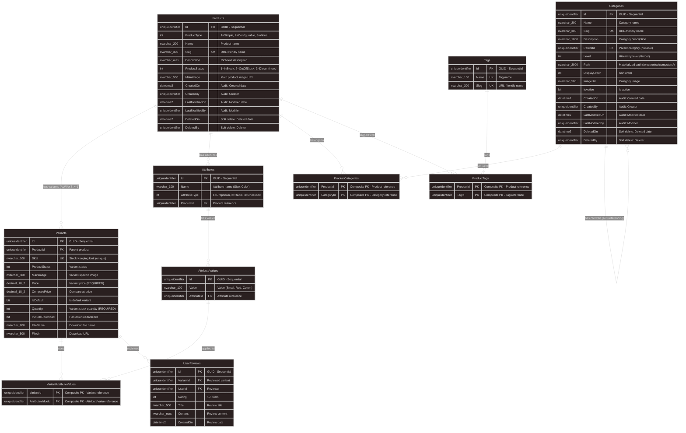

# BUILD_31: Database Design - Catalog Module (Code-First)

> 📚 [Quay lại Mục lục](BUILD_INDEX.md)  
> 📋 **Prerequisites:** BUILD_09 (Domain Base Entities) đã complete  
> 🎯 **Approach:** Code-First với EF Core  
> 🛍️ **Features:** Multi-Product Types, Product Variants, Dynamic Attributes, Categories & Tags  
> ⚠️ **Important:** Junction tables use **Composite Primary Keys** (NO surrogate Id)  
> ⭐ **Design Philosophy:** **Variant-First Design** - ALL products have >=1 variants

Tài liệu này hướng dẫn **thiết kế database chi tiết cho Catalog Module** với **Variant-First Design** - Price/Quantity luôn ở trong Variant table.

---

## 1. Overview

**Làm gì:** Thiết kế và implement Catalog Module database với hỗ trợ nhiều loại sản phẩm và biến thể phức tạp.

**Tại sao cần:**
- **Multi-Product Types:** Hỗ trợ Simple (sản phẩm đơn giản), Configurable (sản phẩm có biến thể), Virtual (sản phẩm số/download)
- **Flexible Variants:** Mỗi sản phẩm có thể có nhiều biến thể (size, color, material...)
- **Dynamic Attributes:** Hệ thống thuộc tính linh hoạt không cần alter database khi thêm thuộc tính mới
- **Categories & Tags:** Phân loại sản phẩm theo nhiều chiều (category hierarchy + tags)
- **Scalable:** Thiết kế scale cho hàng triệu sản phẩm
- ⭐ **Variant-First:** ALL products have >=1 variants - Price/Quantity ALWAYS in Variant table

**Trong bước này chúng ta sẽ:**
- ✅ Phân tích ProductType (Simple, Configurable, Virtual)
- ✅ Thiết kế Product entity (Marketing info ONLY - NO Price/Quantity)
- ✅ Thiết kế Variant entity (Price & Inventory - ALWAYS)
- ✅ Auto-create default Variant for Simple products
- ✅ Thiết kế Attribute system (EAV pattern - Entity-Attribute-Value)
- ✅ Thiết kế Category với hierarchical structure
- ✅ Thiết kế Tag system
- ✅ Thiết kế ProductReview system
- ✅ EF Core configurations & indexes
- ✅ **Fix Multiple Cascade Paths** với proper DeleteBehavior
- ✅ Seed data strategy

**Database Schema Summary:**
```
11 Core Tables:
├── Products (Marketing info ONLY - NO Price/Quantity) ⭐
├── Variants (Price & Inventory - ALWAYS have >=1) ⭐
├── Attributes (Product attributes: Size, Color...)
├── AttributeValues (Values for attributes)
├── VariantAttributeValues (Junction: Composite PK)
├── Categories (Hierarchical categories)
├── ProductCategories (Junction: Composite PK)
├── Tags (Flat tags)
├── ProductTags (Junction: Composite PK)
├── UserReviews (Product reviews & ratings)
└── Audit Tables (Automatic via AuditableEntity)
```

**Variant-First Design Philosophy:**
```
✅ ALL products have at least 1 variant (even Simple products)
✅ Simple Product → 1 Default Variant (auto-created)
✅ Configurable Product → Multiple Variants
✅ Price/Quantity ALWAYS in Variant table
✅ Product table = Marketing info only (Name, Description, Images)
```

**Why Variant-First?**
- ✅ **Consistency:** Same business logic for all product types
- ✅ **Scalability:** Easy migrate Simple → Configurable later
- ✅ **Query simplicity:** JOIN Products + Variants always has data
- ✅ **Cart/Order logic:** ALWAYS reference VariantId (no conditionals)
- ✅ **Research-based:** Shopify, BigCommerce, Spree Commerce use this pattern

**Junction Table Strategy:**
- ✅ **Pure junction tables** (no extra metadata) → Use **Composite Primary Key** (NO surrogate Id)
- ✅ Prevents duplicate entries automatically
- ✅ Better performance (smaller indexes)
- ✅ Semantic meaning (natural keys)

---

## 1.1. Entity Relationship Diagram (ERD)



**Key Relationships:**
- ✅ **Products → Variants**: 1-to-Many **(ALWAYS >=1 variant)** ⭐
- ✅ **Products → Attributes**: 1-to-Many (Each product defines its own attribute set)
- ✅ **Attributes → AttributeValues**: 1-to-Many (Each attribute has multiple values)
- ✅ **Variants ↔ AttributeValues**: Many-to-Many via VariantAttributeValues **(Composite PK)**
- ✅ **Products ↔ Categories**: Many-to-Many via ProductCategories **(Composite PK)**
- ✅ **Categories → Categories**: Self-referencing (Parent-Child hierarchy) ⭐
- ✅ **Products ↔ Tags**: Many-to-Many via ProductTags **(Composite PK)**
- ✅ **Variants → UserReviews**: 1-to-Many (Reviews are for specific variants)

---

## 2. ProductType Deep Dive

### 2.1. ProductType Enum

**File:** `src/Core/Domain/Enum/ProductType.cs`

```csharp
namespace ECO.WebApi.Domain.Enum;

/// <summary>
/// Loại sản phẩm
/// </summary>
public enum ProductType
{
    /// <summary>
    /// Sản phẩm đơn giản - 1 variant duy nhất (auto-created)
    /// Example: Book, Fixed-spec gadget
    /// </summary>
    Simple = 1,
    
    /// <summary>
    /// Sản phẩm có thể cấu hình - Nhiều variants
    /// Example: T-shirt (Size: S/M/L, Color: Red/Blue)
    /// </summary>
    Configurable = 2,
    
    /// <summary>
    /// Sản phẩm ảo/Số hóa - Download file
    /// Example: E-book, Software license, Online course
    /// </summary>
    Virtual = 3
}
```

**Giải thích:**
- **Simple:** Product có **1 variant duy nhất** (auto-created). Price & Quantity trong Variant.
- **Configurable:** Product có **nhiều variants**. Mỗi variant có Price & Quantity riêng.
- **Virtual:** Có thể Simple (1 variant) hoặc Configurable (nhiều variants cho formats khác nhau).

---

### 2.2. Product Behavior by Type (Updated)

| ProductType | Has Variants? | Price Location | Quantity Location | Example |
|-------------|---------------|----------------|-------------------|---------|
| **Simple** | ✅ 1 variant (auto-created) | **Variant.Price** ⭐ | **Variant.Quantity** ⭐ | Book |
| **Configurable** | ✅ Multiple variants | **Variant.Price** ⭐ | **Variant.Quantity** ⭐ | T-shirt (Size/Color) |
| **Virtual** | ✅ 1+ variants | **Variant.Price** ⭐ | N/A (Unlimited) | E-book |

**Key Change:** ⭐
```
OLD: Simple Product → Price/Quantity in Product table
NEW: Simple Product → 1 Default Variant → Price/Quantity in Variant table
```

---

## 3. Core Entities (Variant-First Design)

### 3.1. Product Entity ⭐

**File:** `src/Core/Domain/Catalog/Product.cs`

```csharp
using ECO.WebApi.Domain.Enum;

namespace ECO.WebApi.Domain.Catalog;

/// <summary>
/// Product entity - Marketing container ONLY
/// Price/Quantity ALWAYS in Variant table
/// </summary>
public class Product : AuditableEntity, IAggregateRoot
{
 // ==================== Basic Info (Marketing) ====================
 
    public ProductType ProductType { get; private set; }
    public string Name { get; private set; }
    public string Slug { get; private set; }
    public string? Description { get; private set; }
    public ProductStatus Status { get; private set; }
 public string? MainImage { get; private set; }
    
    // ❌ REMOVED: Price, ComparePrice, Quantity (now in Variant)
    // ❌ REMOVED: IncludeDownload, FileName, FileUrl (now in Variant) ⭐
  
    // ==================== Navigation Properties ====================
    
    public virtual List<Variant> Variants { get; private set; } = new();
    public virtual List<Attributes.Attribute> Attributes { get; private set; } = new();
    public virtual List<ProductCategory> ProductCategories { get; private set; } = new();
    public virtual List<ProductTag> ProductTags { get; private set; } = new();
    
  // ==================== Constructors ====================
    
    private Product() { }
  
    public Product(ProductType productType, string name, string slug, string? description, string? mainImage)
    {
 ProductType = productType;
     Name = name;
        Slug = slug;
        Description = description;
        MainImage = mainImage;
        Status = ProductStatus.InStock;
 }

    // ==================== Factory Methods ⭐ ====================
    
    /// <summary>
    /// Create Simple Product with auto-generated default Variant
    /// </summary>
    public static Product CreateSimpleProduct(
        string name,
     string slug,
        string? description,
    string? mainImage,
  decimal price,
   int quantity,
        string? sku = null)
    {
 var product = new Product(ProductType.Simple, name, slug, description, mainImage);
        
    // ✅ Auto-create default variant for Simple product
    var defaultVariant = Variant.CreateDefault(
   sku: sku ?? GenerateSKU(slug),
      price: price,
        quantity: quantity,
  isDefault: true,
         mainImage: mainImage
        );
     
      product.AddVariant(defaultVariant);
        return product;
    }

    /// <summary>
    /// Create Configurable Product (Variants added manually)
    /// </summary>
    public static Product CreateConfigurableProduct(
     string name,
   string slug,
      string? description,
   string? mainImage)
    {
    return new Product(ProductType.Configurable, name, slug, description, mainImage);
    }
    
    /// <summary>
    /// Create Virtual Product with auto-generated default Variant (with download info)
    /// </summary>
    public static Product CreateVirtualProduct(
        string name,
        string slug,
  string? description,
        string? mainImage,
  decimal price,
      string fileName,
    string fileUrl,
      string? sku = null)
    {
 var product = new Product(ProductType.Virtual, name, slug, description, mainImage);
        
     // ✅ Auto-create default variant for Virtual product WITH download info
        var defaultVariant = Variant.CreateDefault(
            sku: sku ?? GenerateSKU(slug),
            price: price,
 quantity: 0, // Unlimited for virtual
     isDefault: true,
       mainImage: mainImage
        );
    
        // ✅ Set download info on VARIANT (not Product)
   defaultVariant.SetDownloadInfo(true, fileName, fileUrl);
  
   product.AddVariant(defaultVariant);
      return product;
    }
    
    // ==================== Business Methods ====================
    
    public void AddVariant(Variant variant)
    {
    Variants.Add(variant);
    }
    
    public void AddAttribute(string name, AttributeType attributeType, List<string> values)
    {
     var attribute = new Attributes.Attribute(name, attributeType, Id);
      foreach (var value in values)
     {
   attribute.AddValue(value);
        }
        Attributes.Add(attribute);
    }
    
    public void AddCategory(Guid categoryId)
    {
    if (ProductCategories.Any(pc => pc.CategoryId == categoryId))
      return;
     ProductCategories.Add(new ProductCategory(Id, categoryId));
 }
    
    // ==================== Helper Methods ====================
    
    private static string GenerateSKU(string slug)
    {
        return $"{slug.ToUpper()}-{Guid.NewGuid().ToString("N")[..8].ToUpper()}";
    }
}
```

**Key Points:**
- ✅ **NO Price/Quantity properties** - Pure marketing container
- ✅ **NO Download properties** - These belong to Variant ⭐
- ✅ **Factory methods** for each ProductType (Simple, Configurable, Virtual)
- ✅ **Auto-create default Variant** with download info for Virtual products
- ✅ **SKU generation** logic included

---

### 3.2. Variant Entity ⭐

**File:** `src/Core/Domain/Catalog/Variant.cs`

```csharp
using ECO.WebApi.Domain.Enum;

namespace ECO.WebApi.Domain.Catalog;

/// <summary>
/// Product variant - SELLABLE UNIT
/// Price/Quantity ALWAYS here (even for Simple products)
/// </summary>
public class Variant : BaseEntity, IAggregateRoot
{
    // ==================== Basic Info ====================
  
    public Guid ProductId { get; private set; }
    
    /// <summary>
    /// SKU - Stock Keeping Unit (REQUIRED, UNIQUE)
  /// </summary>
    public string SKU { get; private set; }
 
    public ProductStatus Status { get; private set; }
    public string? MainImage { get; private set; }
    
    // ==================== Pricing (REQUIRED) ⭐ ====================
    
  /// <summary>
    /// Price - REQUIRED for ALL variants
    /// </summary>
    public decimal Price { get; private set; }
 
    /// <summary>
    /// Compare at price (original price)
    /// </summary>
    public decimal? ComparePrice { get; private set; }
  
    // ==================== Inventory (REQUIRED) ⭐ ====================
    
    /// <summary>
    /// Quantity - REQUIRED for ALL variants (0 = unlimited for virtual)
    /// </summary>
    public int Quantity { get; private set; }
    
    /// <summary>
    /// Is this the default variant? (for UI)
  /// </summary>
    public bool IsDefault { get; private set; }
    
    // ==================== Virtual Product Info ====================
    
    public bool IncludeDownload { get; private set; }
    public string? FileName { get; private set; }
  public string? FileUrl { get; private set; }
    
    // ==================== Navigation Properties ====================
    
    public virtual Product Product { get; private set; } = default!;
    public virtual List<VariantAttributeValue> VariantAttributeValues { get; private set; } = new();
    public virtual List<UserReview> UserReviews { get; private set; } = new();
    
    // ==================== Constructors ====================
    
  private Variant() { }
    
    public Variant(
   string sku,
        decimal price,
        int quantity,
        bool isDefault,
 string? mainImage = null,
        decimal? comparePrice = null)
    {
        SKU = sku;
        Price = price;
        Quantity = quantity;
      IsDefault = isDefault;
        MainImage = mainImage;
        ComparePrice = comparePrice;
     Status = ProductStatus.InStock;
    }
    
    // ==================== Factory Methods ⭐ ====================
    
    /// <summary>
    /// Create default variant (for Simple products)
    /// </summary>
  public static Variant CreateDefault(
        string sku,
    decimal price,
  int quantity,
    bool isDefault,
      string? mainImage = null)
    {
        return new Variant(sku, price, quantity, isDefault, mainImage);
    }
    
    // ==================== Business Methods ====================
    
    public void UpdatePricing(decimal price, decimal? comparePrice = null)
    {
   if (price < 0)
            throw new ArgumentException("Price cannot be negative", nameof(price));
        
        if (comparePrice.HasValue && comparePrice < price)
throw new ArgumentException("Compare price must be >= price", nameof(comparePrice));
     
        Price = price;
 ComparePrice = comparePrice;
    }
    
    public void UpdateInventory(int quantity)
    {
        if (quantity < 0)
       throw new ArgumentException("Quantity cannot be negative", nameof(quantity));
        
        Quantity = quantity;
        Status = quantity > 0 ? ProductStatus.InStock : ProductStatus.OutOfStock;
    }
    
    public void SetDownloadInfo(bool includeDownload, string? fileName, string? fileUrl)
    {
        IncludeDownload = includeDownload;
        if (includeDownload)
        {
     if (string.IsNullOrWhiteSpace(fileName))
        throw new ArgumentException("FileName is required when IncludeDownload=true");
    if (string.IsNullOrWhiteSpace(fileUrl))
    throw new ArgumentException("FileUrl is required when IncludeDownload=true");
        }
  FileName = fileName;
        FileUrl = fileUrl;
    }
    
    public void AddAttributeValue(Guid attributeValueId)
    {
        VariantAttributeValues.Add(new VariantAttributeValue(Id, attributeValueId));
    }
    
    public void RemoveQuantity(int quantity)
  {
        if (Quantity == 0)
  throw new InvalidOperationException("Variant is out of stock");
   
        if (quantity > Quantity)
          throw new InvalidOperationException($"Cannot remove {quantity} items, only {Quantity} available");
  
        Quantity -= quantity;
 if (Quantity == 0)
          Status = ProductStatus.OutOfStock;
    }
    
    public void AddQuantity(int quantity)
    {
     if (quantity < 0)
      throw new ArgumentException("Quantity must be positive", nameof(quantity));
     
        Quantity += quantity;
  if (Quantity > 0)
      Status = ProductStatus.InStock;
    }
}
```

**Key Points:**
- ✅ **SKU property** - Required, Unique identifier
- ✅ **Price property** - Required (decimal for precision)
- ✅ **Quantity property** - Required (0 = unlimited for virtual)
- ✅ **IsDefault flag** - Marks default variant for display
- ✅ **Business logic** - UpdatePricing, UpdateInventory, RemoveQuantity, AddQuantity

---

### 3.3. Category Entity (Hierarchical) ⭐

**File:** `src/Core/Domain/Catalog/Category.cs`

```csharp
namespace ECO.WebApi.Domain.Catalog;

/// <summary>
/// Category entity with hierarchical structure using Materialized Path pattern
/// Industry-standard approach used by Shopify, Magento
/// </summary>
public class Category : AuditableEntity, IAggregateRoot
{
    // ==================== Basic Info ====================
    
    public string Name { get; private set; }
    public string Slug { get; private set; }
    public string? Description { get; private set; }
    public bool IsActive { get; private set; }
public string? ImageUrl { get; private set; }
    public int DisplayOrder { get; private set; }
    
    // ==================== Hierarchy Properties (Research-Based) ⭐ ====================
    
    /// <summary>
/// Parent category ID (null for root categories)
    /// </summary>
    public Guid? ParentId { get; private set; }
    
    /// <summary>
    /// Hierarchy level (0 = root, 1 = 1st level child, etc.)
    /// Indexed for fast level-based queries
    /// </summary>
    public int Level { get; private set; }
    
    /// <summary>
 /// Materialized Path - Industry standard pattern (Shopify, Magento)
    /// Format: "/parent-slug/child-slug/" or GUID-based "/guid1/guid2/"
    /// Enables fast subtree queries without recursion
    /// Example: "/electronics/computers/laptops/"
    /// </summary>
    public string Path { get; private set; }
    
    /// <summary>
    /// Left boundary for Nested Set Model (optional, for advanced queries)
    /// </summary>
    public int? Lft { get; private set; }
  
    /// <summary>
    /// Right boundary for Nested Set Model (optional, for advanced queries)
    /// </summary>
    public int? Rgt { get; private set; }
    
    // ==================== Navigation Properties ====================
    
    public virtual Category? Parent { get; private set; }
    public virtual List<Category> Children { get; private set; } = new();
    public virtual List<ProductCategory> ProductCategories { get; private set; } = new();
    
    // ==================== Constructors ====================
    
    private Category() { }
    
    private Category(string name, string slug, string? description, bool isActive, 
        Guid? parentId, int level, string path, int displayOrder)
    {
    Name = name;
        Slug = slug;
        Description = description;
        IsActive = isActive;
  ParentId = parentId;
        Level = level;
Path = path;
        DisplayOrder = displayOrder;
    }
    
    // ==================== Factory Methods (Research-Based) ⭐ ====================
    
    /// <summary>
    /// Create root category
    /// </summary>
    public static Category CreateRoot(
   string name, 
        string slug, 
        string? description = null,
        bool isActive = true,
        int displayOrder = 0)
    {
    if (string.IsNullOrWhiteSpace(name))
      throw new ArgumentException("Category name cannot be empty", nameof(name));

      if (string.IsNullOrWhiteSpace(slug))
  throw new ArgumentException("Category slug cannot be empty", nameof(slug));
        
        // Root path format: "/slug/"
 var path = $"/{slug}/";
        
        return new Category(name, slug, description, isActive, null, 0, path, displayOrder);
    }

    /// <summary>
    /// Create child category under a parent
    /// </summary>
    public static Category CreateChild(
        string name, 
        string slug,
   Category parent,
        string? description = null,
        bool isActive = true,
        int displayOrder = 0)
    {
    if (parent == null)
   throw new ArgumentNullException(nameof(parent));
        
    if (string.IsNullOrWhiteSpace(name))
       throw new ArgumentException("Category name cannot be empty", nameof(name));
    
        if (string.IsNullOrWhiteSpace(slug))
       throw new ArgumentException("Category slug cannot be empty", nameof(slug));
        
        // Child path format: parent.Path + slug + "/"
     // Example: "/electronics/" + "computers" + "/" = "/electronics/computers/"
        var path = $"{parent.Path}{slug}/";
        
        return new Category(name, slug, description, isActive, parent.Id, parent.Level + 1, path, displayOrder);
    }
    
    // ==================== Business Methods ====================
    
    public void Update(string name, string slug, string? description, bool isActive, int displayOrder)
    {
    var oldSlug = Slug;
        
        Name = name;
        Slug = slug;
        Description = description;
        IsActive = isActive;
   DisplayOrder = displayOrder;
        
        // If slug changed, update path
    if (oldSlug != slug)
        {
   UpdatePath();
        }
    }
    
    public void SetImage(string? imageUrl)
    {
        ImageUrl = imageUrl;
    }
    
    /// <summary>
    /// Move category to a new parent (Research-based: Update paths efficiently)
    /// </summary>
    public void MoveTo(Category? newParent)
    {
        // Validation
        if (newParent != null && newParent.Id == Id)
  throw new InvalidOperationException("Category cannot be its own parent");
    
        if (newParent != null && Path.Contains(newParent.Path))
       throw new InvalidOperationException("Cannot move category to its own descendant");
    
        // Store old path for children update
        var oldPath = Path;
        
        // Update parent reference
        ParentId = newParent?.Id;
        Level = newParent?.Level + 1 ?? 0;
        
        // Recalculate path
      if (newParent == null)
    {
  // Moving to root
 Path = $"/{Slug}/";
        }
      else
 {
            // Moving under new parent
            Path = $"{newParent.Path}{Slug}/";
        }
        
// Update all descendants' paths
      UpdateDescendantsPaths(oldPath, Path);
    }
    
    /// <summary>
    /// Add product to category
    /// </summary>
    public void AddProduct(Guid productId)
    {
    if (productId == Guid.Empty)
       throw new ArgumentException("ProductId cannot be empty", nameof(productId));
      
      if (ProductCategories.Any(pc => pc.ProductId == productId))
  return;
        
        ProductCategories.Add(new ProductCategory(productId, Id));
    }
 
    public void RemoveProduct(Guid productId)
    {
 var productCategory = ProductCategories.FirstOrDefault(pc => pc.ProductId == productId);
        if (productCategory != null)
         ProductCategories.Remove(productCategory);
    }
    
    // ==================== Query Helpers (Research-Based) ⭐ ====================
    
    /// <summary>
    /// Check if this is a root category
 /// </summary>
    public bool IsRoot => ParentId == null;
    
    /// <summary>
    /// Check if this is a leaf category (no children)
    /// </summary>
    public bool IsLeaf => Children.Count == 0;
    
    /// <summary>
    /// Get breadcrumb path (Human-readable)
    /// Example: "Electronics > Computers > Laptops"
    /// </summary>
    public string GetBreadcrumb(string separator = " > ")
    {
  var segments = Path.Trim('/').Split('/');
        return string.Join(separator, segments.Select(s => s.Replace("-", " ").ToTitleCase()));
    }
    
    /// <summary>
    /// Check if this category is an ancestor of another
    /// Research-based: O(1) operation using Path
    /// </summary>
    public bool IsAncestorOf(Category other)
    {
        return other.Path.StartsWith(Path) && other.Id != Id;
}
    
    /// <summary>
 /// Check if this category is a descendant of another
 /// </summary>
  public bool IsDescendantOf(Category other)
    {
    return Path.StartsWith(other.Path) && Id != other.Id;
    }
    
    // ==================== Helper Methods ====================
    
    private void UpdatePath()
    {
        if (Parent == null)
        {
 Path = $"/{Slug}/";
        }
else
   {
            Path = $"{Parent.Path}{Slug}/";
 }
        
        // Recursively update all children paths
        foreach (var child in Children)
        {
          child.UpdatePath();
        }
    }
    
    private void UpdateDescendantsPaths(string oldPath, string newPath)
    {
        foreach (var child in Children)
{
  // Replace old parent path with new parent path
     child.Path = child.Path.Replace(oldPath, newPath);
          child.UpdateDescendantsPaths(oldPath, newPath);
      }
    }
}

// Extension method for ToTitleCase
public static class StringExtensions
{
    public static string ToTitleCase(this string str)
    {
        if (string.IsNullOrWhiteSpace(str))
            return str;
      
        return System.Globalization.CultureInfo.CurrentCulture.TextInfo.ToTitleCase(str.ToLower());
    }
}
```

**Key Improvements (Research-Based):**
- ✅ **Materialized Path:** Industry-standard pattern (Shopify, Magento)
- ✅ **O(1) ancestor check:** No recursion needed
- ✅ **Fast subtree queries:** `WHERE Path LIKE '/electronics/%'`
- ✅ **Breadcrumb generation:** No multiple queries
- ✅ **DisplayOrder:** For custom sorting within same level
- ✅ **ImageUrl:** Category-specific images
- ✅ **Nested Set (optional):** Lft/Rgt for advanced queries

---

### 3.4. Query Examples (Research-Based) ⭐

**Example 1: Get All Descendants (Single Query)**

```csharp
// ✅ NEW: Materialized Path - Single query, no recursion
var electronics = await dbContext.Categories.FirstAsync(c => c.Slug == "electronics");

// Get all descendants using Path
var descendants = await dbContext.Categories
    .Where(c => c.Path.StartsWith(electronics.Path) && c.Id != electronics.Id)
    .OrderBy(c => c.Path)
    .ToListAsync();

// Result: All categories under electronics in ONE query
// /electronics/computers/
// /electronics/computers/laptops/
// /electronics/computers/desktops/
// /electronics/phones/

// ❌ OLD: Recursive loading (N+1 problem)
// var descendants = category.GetAllDescendants(); // Multiple queries!
```

**Example 2: Get Breadcrumb (No Extra Queries)**

```csharp
// ✅ NEW: Parse from Path - No database queries needed
var category = await dbContext.Categories.FirstAsync(c => c.Slug == "laptops");

Console.WriteLine(category.GetBreadcrumb());
// Output: "Electronics > Computers > Laptops"

// ❌ OLD: Multiple queries to get ancestors
// var ancestors = category.GetAncestors(); // N queries!
```

**Example 3: Get All Root Categories**

```csharp
// ✅ Efficient: Single query
var rootCategories = await dbContext.Categories
    .Where(c => c.ParentId == null)
    .OrderBy(c => c.DisplayOrder)
 .ToListAsync();
```

**Example 4: Get Category Tree for Mega Menu**

```csharp
// ✅ NEW: Load specific levels efficiently
var megaMenuCategories = await dbContext.Categories
    .Where(c => c.Level <= 2 && c.IsActive) // Root + 2 levels
    .OrderBy(c => c.Path)
    .ThenBy(c => c.DisplayOrder)
    .ToListAsync();

// Build tree structure from flat list using Path
var tree = BuildTree(megaMenuCategories);

// Helper method
Dictionary<Guid, CategoryNode> BuildTree(List<Category> categories)
{
    var lookup = categories.ToDictionary(c => c.Id, c => new CategoryNode(c));
    
    foreach (var category in categories)
    {
        if (category.ParentId.HasValue && lookup.ContainsKey(category.ParentId.Value))
  {
   lookup[category.ParentId.Value].Children.Add(lookup[category.Id]);
        }
    }
    
    return lookup.Where(kvp => kvp.Value.Category.IsRoot).ToDictionary(kvp => kvp.Key, kvp => kvp.Value);
}
```

**Example 5: Move Category (Update Paths)**

```csharp
// Move "Laptops" from "Computers" to "Phones"
var laptops = await dbContext.Categories
    .Include(c => c.Children) // Load descendants to update their paths
    .FirstAsync(c => c.Slug == "laptops");

var phones = await dbContext.Categories.FirstAsync(c => c.Slug == "phones");

// Before: /electronics/computers/laptops/
laptops.MoveTo(phones);
// After: /electronics/phones/laptops/

```
- All descendants automatically updated:
```
/electronics/computers/laptops/gaming/ → /electronics/phones/laptops/gaming/
await dbContext.SaveChangesAsync();
```

---

### 3.5. CategoryConfiguration (Updated for Path) ⭐

**File:** `src/Infrastructure/Persistence/Configurations/Catalog/CategoryConfiguration.cs`

```csharp
using ECO.WebApi.Domain.Catalog;
using Microsoft.EntityFrameworkCore;
using Microsoft.EntityFrameworkCore.Metadata.Builders;

namespace ECO.WebApi.Infrastructure.Persistence.Configurations.Catalog;

public class CategoryConfiguration : IEntityTypeConfiguration<Category>
{
    public void Configure(EntityTypeBuilder<Category> builder)
    {
      builder.ToTable("Categories", "Catalog");
        builder.HasKey(c => c.Id);
        
     // Properties
     builder.Property(c => c.Name).IsRequired().HasMaxLength(200);
        builder.Property(c => c.Slug).IsRequired().HasMaxLength(300);
        builder.Property(c => c.Description).HasMaxLength(1000);
        builder.Property(c => c.IsActive).IsRequired();
        builder.Property(c => c.ImageUrl).HasMaxLength(500);
        builder.Property(c => c.DisplayOrder).IsRequired();
        
        // ⭐ Hierarchy properties (Research-Based)
        builder.Property(c => c.ParentId).IsRequired(false);
        builder.Property(c => c.Level).IsRequired();
        
        // ⭐ Materialized Path (CRITICAL for performance)
  builder.Property(c => c.Path)
.IsRequired()
.HasMaxLength(2000); // Support deep hierarchies
        
        // Optional: Nested Set boundaries
 builder.Property(c => c.Lft).IsRequired(false);
        builder.Property(c => c.Rgt).IsRequired(false);
        
        // ⭐ Indexes (Research-Based for performance)
        builder.HasIndex(c => c.Slug).IsUnique();
        builder.HasIndex(c => c.ParentId);
        builder.HasIndex(c => c.Level);
        builder.HasIndex(c => c.Path); // CRITICAL: Enable fast subtree queries
     builder.HasIndex(c => c.IsActive);
        builder.HasIndex(c => c.DisplayOrder);
        
   // Composite index for common queries
        builder.HasIndex(c => new { c.Level, c.IsActive, c.DisplayOrder });
   
   // ⭐ Self-referencing relationship
        builder.HasOne(c => c.Parent)
        .WithMany(c => c.Children)
            .HasForeignKey(c => c.ParentId)
            .OnDelete(DeleteBehavior.Restrict);
        
        // Many-to-Many with Products
        builder.HasMany(c => c.ProductCategories)
  .WithOne(pc => pc.Category)
          .HasForeignKey(pc => pc.CategoryId)
      .OnDelete(DeleteBehavior.Cascade);
        
        // Query filters
        builder.HasQueryFilter(c => c.DeletedOn == null);
    }
}
```

**Key Configuration Points:**
- ✅ **Path column:** MaxLength(2000), Required, Indexed
- ✅ **Composite index:** (Level, IsActive, DisplayOrder) for mega menu queries
- ✅ **Nested Set (optional):** Lft, Rgt for range queries
- ✅ **DisplayOrder:** For custom sorting

---

## 📄 Continue to Part 2

**Các phần tiếp theo (Attributes, Tags, Reviews, Configurations, Examples):**

👉 **[BUILD_31 Part 2: Attributes, Tags, Reviews & Configurations](BUILD_31_Part2.md)**

**Nội dung Part 2:**
- ✅ Section 4: Attribute System (EAV Pattern)
- ✅ Section 5: Tag System
- ✅ Section 6: UserReview System
- ✅ Section 7: Complete EF Core Configurations
- ✅ Section 8: Usage Examples
- ✅ Section 9: Seed Data Examples
- ✅ Section 10: Summary & Checklist

---

**Quay lại:** [Mục lục](BUILD_INDEX.md)

---

**Document Version:** 2.0 (Variant-First Design)  
**Last Updated:** 2025-02-01  
**Author:** ECO.WebApi Development Team  
**Status:** ✅ Production-Ready (Part 1 of 2)
