# BUILD_32: Database Design - Order & Cart Module (Code-First)

> 📚 [Quay lại Mục lục](BUILD_INDEX.md)  
> 📋 **Prerequisites:** BUILD_31 (Catalog Module) đã complete  
> 🎯 **Approach:** Code-First với EF Core  
> 🛒 **Features:** Order Management, Shopping Cart, Order Tracking, Payment Integration  
> ⚠️ **Important:** Price Snapshot Strategy - Store prices at order time  
> ⭐ **Design Philosophy:** **Event-Driven Order Lifecycle** - Track every status change

Tài liệu này hướng dẫn **thiết kế database chi tiết cho Order & Cart Module** với **Price Snapshot Design** - Prices stored at order time, not referenced.

---

## 1. Overview

**Làm gì:** Thiết kế và implement Order & Cart Module database với order lifecycle tracking và shopping cart management.

**Tại sao cần:**
- **Order Management:** Complete order lifecycle from creation to delivery
- **Price Snapshot:** Historical accuracy - prices don't change after order placed
- **Cart Persistence:** Save carts for logged-in users, support anonymous carts
- **Order Tracking:** Full audit trail of all status changes
- **Payment Integration:** Ready for payment gateway integration (VNPay, Stripe)
- **Inventory Integration:** Automatic stock deduction on order confirmation
- ⭐ **Event-Driven:** Domain events for order lifecycle (Created, Confirmed, Shipped, Delivered)

**Trong bước này chúng ta sẽ:**
- ✅ Thiết kế Order entity với Price Snapshot strategy
- ✅ Thiết kế OrderItem entity (snapshot: UnitPrice, ProductName, SKU)
- ✅ Thiết kế OrderStatusHistory cho audit trail
- ✅ Thiết kế Cart entity (persistent + anonymous support)
- ✅ Thiết kế CartItem entity
- ✅ Thiết kế ShippingAddress entity
- ✅ Thiết kế PaymentTransaction entity
- ✅ EF Core configurations & indexes
- ✅ Domain events cho Order lifecycle
- ✅ Inventory integration logic

**Database Schema Summary:**
```
10 Core Tables:
├── Orders (Order header: Status, Total, UserId, ShippingAddress)
├── OrderItems (Order details: VariantId, UnitPrice snapshot, Quantity)
├── OrderStatusHistory (Audit trail: Status changes tracking)
├── ShippingAddresses (Customer delivery addresses)
├── PaymentTransactions (Payment records: Method, Status, TransactionId)
├── Carts (Shopping carts: UserId or SessionId)
├── CartItems (Cart contents: VariantId, Quantity)
├── Coupons (Optional: Discount codes)
├── OrderCoupons (Optional: Junction table)
└── Audit Tables (Automatic via AuditableEntity)
```

**Price Snapshot Strategy:**
```
✅ OrderItem stores UnitPrice at order time (NOT reference Variant.Price)
✅ OrderItem stores ProductName snapshot (in case product renamed)
✅ OrderItem stores VariantSKU snapshot (in case SKU changed)
✅ Order.TotalAmount calculated from OrderItems (immutable)
✅ Historical accuracy: Old orders show correct prices even if current prices changed
```

**Why Price Snapshot?**
- ✅ **Historical Accuracy:** Orders are legal documents - prices must be fixed
- ✅ **Regulatory Compliance:** Tax/VAT calculations based on purchase price
- ✅ **Customer Trust:** Invoice shows price customer paid, not current price
- ✅ **Business Analytics:** Accurate profit margin calculations
- ✅ **Research-based:** Shopify, Amazon, eBay use this pattern

---

## 1.1. Entity Relationship Diagram (ERD)

```mermaid
---
config:
  theme: neo-dark
---
erDiagram
    
    Orders {
        uniqueidentifier Id PK "GUID - Sequential"
        uniqueidentifier UserId FK "Customer reference"
     string OrderNumber UK "Human-readable order number"
        int OrderStatus "1=Pending, 2=Confirmed, 3=Processing, 4=Shipped, 5=Delivered, 6=Cancelled"
        decimal_18_2 SubtotalAmount "Sum of OrderItems"
        decimal_18_2 ShippingAmount "Shipping cost"
        decimal_18_2 TaxAmount "Tax/VAT"
        decimal_18_2 DiscountAmount "Discount applied"
        decimal_18_2 TotalAmount "Final total"
        uniqueidentifier ShippingAddressId FK "Shipping address reference"
        nvarchar_500 CustomerNotes "Customer notes"
        datetime2 OrderDate "Order creation date"
   datetime2 ConfirmedAt "Payment confirmed date"
        datetime2 ShippedAt "Shipped date"
  datetime2 DeliveredAt "Delivered date"
        datetime2 CreatedOn "Audit: Created date"
  uniqueidentifier CreatedBy "Audit: Creator"
        datetime2 LastModifiedOn "Audit: Modified date"
        uniqueidentifier LastModifiedBy "Audit: Modifier"
    }
    
    OrderItems {
        uniqueidentifier Id PK "GUID - Sequential"
      uniqueidentifier OrderId FK "Parent order"
        uniqueidentifier VariantId FK "Variant reference (for tracking only)"
  string SnapshotProductName "Product name AT ORDER TIME"
        string SnapshotVariantSKU "Variant SKU AT ORDER TIME"
        string SnapshotVariantImage "Variant image AT ORDER TIME"
        decimal_18_2 UnitPrice "Price AT ORDER TIME (snapshot)"
        int Quantity "Quantity ordered"
        decimal_18_2 Subtotal "UnitPrice * Quantity"
    }
    
 OrderStatusHistory {
     uniqueidentifier Id PK "GUID - Sequential"
        uniqueidentifier OrderId FK "Order reference"
        int FromStatus "Previous status"
        int ToStatus "New status"
     uniqueidentifier ChangedBy FK "User who changed status"
      datetime2 ChangedAt "Change timestamp"
        nvarchar_500 Notes "Change reason/notes"
    }
  
    ShippingAddresses {
      uniqueidentifier Id PK "GUID - Sequential"
   uniqueidentifier UserId FK "Owner user"
        nvarchar_100 RecipientName "Recipient full name"
        nvarchar_20 PhoneNumber "Contact phone"
      nvarchar_200 AddressLine1 "Address line 1"
        nvarchar_200 AddressLine2 "Address line 2 (optional)"
        nvarchar_100 City "City"
        nvarchar_100 StateProvince "State/Province"
     nvarchar_20 PostalCode "Postal/ZIP code"
        nvarchar_100 Country "Country"
        bit IsDefault "Is default address"
        datetime2 CreatedOn "Audit: Created date"
  uniqueidentifier CreatedBy "Audit: Creator"
    }
    
    PaymentTransactions {
uniqueidentifier Id PK "GUID - Sequential"
        uniqueidentifier OrderId FK "Order reference"
  string TransactionId UK "External transaction ID"
        int PaymentMethod "1=COD, 2=CreditCard, 3=BankTransfer, 4=VNPay, 5=Momo"
        int PaymentStatus "1=Pending, 2=Completed, 3=Failed, 4=Refunded"
        decimal_18_2 Amount "Payment amount"
     nvarchar_100 PaymentGateway "Gateway provider name"
        nvarchar_max PaymentData "JSON metadata from gateway"
        datetime2 PaidAt "Payment completion date"
        datetime2 CreatedOn "Transaction creation date"
    }
    
    Carts {
        uniqueidentifier Id PK "GUID - Sequential"
        uniqueidentifier UserId FK "User reference (nullable for anonymous)"
      nvarchar_100 SessionId "Session ID for anonymous carts"
        datetime2 CreatedAt "Cart creation date"
    datetime2 ExpiresAt "Cart expiration date"
        datetime2 LastModifiedAt "Last activity timestamp"
    }
    
    CartItems {
  uniqueidentifier Id PK "GUID - Sequential"
        uniqueidentifier CartId FK "Parent cart"
     uniqueidentifier VariantId FK "Variant reference"
      int Quantity "Quantity in cart"
        datetime2 AddedAt "Item added timestamp"
    }
    
    Coupons {
        uniqueidentifier Id PK "GUID - Sequential"
nvarchar_50 Code UK "Coupon code"
        nvarchar_200 Description "Coupon description"
        int DiscountType "1=Percentage, 2=FixedAmount"
    decimal_18_2 DiscountValue "Discount amount or percentage"
        decimal_18_2 MinimumOrderAmount "Minimum order to apply"
        int MaxUsageCount "Maximum uses (0=unlimited)"
        int CurrentUsageCount "Current usage count"
        datetime2 ValidFrom "Valid from date"
        datetime2 ValidTo "Valid to date"
      bit IsActive "Is coupon active"
        datetime2 CreatedOn "Audit: Created date"
    }
    
    OrderCoupons {
        uniqueidentifier OrderId PK "Composite PK - Order reference"
        uniqueidentifier CouponId PK "Composite PK - Coupon reference"
  decimal_18_2 DiscountApplied "Discount amount applied"
  }
    
    Orders ||--o{ OrderItems : "contains"
  Orders ||--o{ OrderStatusHistory : "has history"
    Orders ||--o| ShippingAddresses : "ships to"
    Orders ||--o{ PaymentTransactions : "has payments"
    Orders ||--o{ OrderCoupons : "uses coupons"
    Coupons ||--o{ OrderCoupons : "applied to"
    Carts ||--o{ CartItems : "contains"
    CartItems }o--|| Variants : "references (from BUILD_31)"
    OrderItems }o--|| Variants : "references (from BUILD_31)"
```



**Key Relationships:**
- ✅ **Orders → OrderItems**: 1-to-Many (Order header + details)
- ✅ **Orders → OrderStatusHistory**: 1-to-Many (Complete audit trail)
- ✅ **Orders → ShippingAddresses**: Many-to-One (Address reuse)
- ✅ **Orders → PaymentTransactions**: 1-to-Many (Multiple payment attempts)
- ✅ **Orders ↔ Coupons**: Many-to-Many via OrderCoupons (Composite PK)
- ✅ **Carts → CartItems**: 1-to-Many (Cart contents)
- ✅ **CartItems → Variants**: Many-to-One (Reference from BUILD_31)
- ✅ **OrderItems → Variants**: Many-to-One (Reference for tracking, NOT for price)

---

## 2. OrderStatus Deep Dive

### 2.1. OrderStatus Enum

**File:** `src/Core/Domain/Enum/OrderStatus.cs`

```csharp
namespace ECO.WebApi.Domain.Enum;

/// <summary>
/// Order status workflow
/// </summary>
public enum OrderStatus
{
    /// <summary>
    /// Order created, awaiting payment confirmation
    /// </summary>
    Pending = 1,
    
    /// <summary>
    /// Payment confirmed, ready to process
    /// </summary>
    PaymentConfirmed = 2,
    
    /// <summary>
    /// Order being prepared/packed
    /// </summary>
    Processing = 3,
    
    /// <summary>
    /// Order shipped to customer
    /// </summary>
    Shipped = 4,
    
    /// <summary>
    /// Order delivered successfully
    /// </summary>
    Delivered = 5,
    
    /// <summary>
    /// Order cancelled by customer or admin
    /// </summary>
    Cancelled = 6,
    
    /// <summary>
    /// Order refunded (full or partial)
    /// </summary>
    Refunded = 7
}
```

**Order Status Workflow:**
```
Pending → PaymentConfirmed → Processing → Shipped → Delivered
   ↓                ↓              ↓
Cancelled       Cancelled
   ↓                 ↓
 Refunded         Refunded
```

---

### 2.2. PaymentMethod Enum

**File:** `src/Core/Domain/Enum/PaymentMethod.cs`

```csharp
namespace ECO.WebApi.Domain.Enum;

/// <summary>
/// Payment method types
/// </summary>
public enum PaymentMethod
{
    /// <summary>
    /// Cash on delivery
    /// </summary>
    CashOnDelivery = 1,
    
    /// <summary>
    /// Credit/Debit card
    /// </summary>
    CreditCard = 2,
    
    /// <summary>
    /// Bank transfer
    /// </summary>
 BankTransfer = 3,
    
    /// <summary>
    /// VNPay payment gateway
    /// </summary>
    VNPay = 4,
    
    /// <summary>
  /// Momo e-wallet
    /// </summary>
    Momo = 5,
    
    /// <summary>
    /// ZaloPay e-wallet
    /// </summary>
    ZaloPay = 6
}
```

---

### 2.3. PaymentStatus Enum

**File:** `src/Core/Domain/Enum/PaymentStatus.cs`

```csharp
namespace ECO.WebApi.Domain.Enum;

/// <summary>
/// Payment transaction status
/// </summary>
public enum PaymentStatus
{
    /// <summary>
    /// Payment pending/awaiting
    /// </summary>
    Pending = 1,
    
    /// <summary>
    /// Payment successful
    /// </summary>
    Completed = 2,
    
    /// <summary>
    /// Payment failed
    /// </summary>
    Failed = 3,
    
    /// <summary>
    /// Payment refunded
    /// </summary>
    Refunded = 4,
    
    /// <summary>
    /// Payment cancelled
    /// </summary>
    Cancelled = 5
}
```

---

## 3. Core Entities (Price Snapshot Design)

### 3.1. Order Entity ⭐⭐⭐

**File:** `src/Core/Domain/Order/Order.cs`

```csharp
using ECO.WebApi.Domain.Enum;

namespace ECO.WebApi.Domain.Order;

/// <summary>
/// Order aggregate root
/// Contains snapshot of prices at order time
/// </summary>
public class Order : AuditableEntity, IAggregateRoot
{
    // ==================== Basic Info ====================
    
    public Guid UserId { get; private set; }
    public string OrderNumber { get; private set; }
    public OrderStatus Status { get; private set; }
    public DateTime OrderDate { get; private set; }
    
    // ==================== Pricing (Immutable after creation) ⭐ ====================
    
    /// <summary>
    /// Sum of all OrderItems.Subtotal
    /// </summary>
    public decimal SubtotalAmount { get; private set; }
    
    /// <summary>
    /// Shipping cost
    /// </summary>
    public decimal ShippingAmount { get; private set; }
    
    /// <summary>
    /// Tax/VAT amount
    /// </summary>
    public decimal TaxAmount { get; private set; }
    
    /// <summary>
    /// Discount amount from coupons
    /// </summary>
    public decimal DiscountAmount { get; private set; }
  
    /// <summary>
    /// Final total = Subtotal + Shipping + Tax - Discount
    /// </summary>
    public decimal TotalAmount { get; private set; }
 
    // ==================== Shipping Info ====================
    
    public Guid ShippingAddressId { get; private set; }
    public string? CustomerNotes { get; private set; }
    
    // ==================== Timestamps ====================
    
    public DateTime? ConfirmedAt { get; private set; }
    public DateTime? ShippedAt { get; private set; }
    public DateTime? DeliveredAt { get; private set; }
    
    // ==================== Navigation Properties ====================
    
    public virtual ApplicationUser User { get; private set; } = default!;
    public virtual ShippingAddress ShippingAddress { get; private set; } = default!;
public virtual List<OrderItem> OrderItems { get; private set; } = new();
    public virtual List<OrderStatusHistory> StatusHistory { get; private set; } = new();
public virtual List<PaymentTransaction> PaymentTransactions { get; private set; } = new();
    public virtual List<OrderCoupon> OrderCoupons { get; private set; } = new();
    
    // ==================== Constructors ====================
    
  private Order() { }
    
    private Order(
        Guid userId,
 string orderNumber,
        Guid shippingAddressId,
        string? customerNotes)
    {
        UserId = userId;
    OrderNumber = orderNumber;
        ShippingAddressId = shippingAddressId;
        CustomerNotes = customerNotes;
     Status = OrderStatus.Pending;
        OrderDate = DateTime.UtcNow;
    }
    
    // ==================== Factory Methods ⭐ ====================
    
    /// <summary>
    /// Create order from cart with price snapshots
    /// </summary>
    public static Order CreateFromCart(
        Guid userId,
        Cart cart,
    Guid shippingAddressId,
 decimal shippingAmount,
     decimal taxAmount,
        string? customerNotes = null)
    {
        if (!cart.CartItems.Any())
     throw new InvalidOperationException("Cannot create order from empty cart");
        
        var orderNumber = GenerateOrderNumber();
        var order = new Order(userId, orderNumber, shippingAddressId, customerNotes);
        
        // ✅ Create OrderItems with price snapshots
        foreach (var cartItem in cart.CartItems)
        {
      var orderItem = OrderItem.CreateFromCartItem(cartItem);
            order.AddItem(orderItem);
        }
        
      // Calculate totals
  order.SubtotalAmount = order.OrderItems.Sum(x => x.Subtotal);
        order.ShippingAmount = shippingAmount;
        order.TaxAmount = taxAmount;
        order.DiscountAmount = 0; // Updated when coupons applied
        order.RecalculateTotal();
        
    // Raise domain event
        order.AddDomainEvent(new OrderCreatedEvent(order.Id));
        
 return order;
    }
  
    // ==================== Business Methods ====================
    
    public void AddItem(OrderItem item)
    {
      if (Status != OrderStatus.Pending)
            throw new InvalidOperationException("Cannot modify confirmed order");
      
        OrderItems.Add(item);
    }
    
    public void ApplyCoupon(Coupon coupon)
 {
        if (Status != OrderStatus.Pending)
       throw new InvalidOperationException("Cannot apply coupon to confirmed order");
        
        // ✅ Single coupon only: Remove existing coupon first
     if (OrderCoupons.Any())
            throw new InvalidOperationException("Order already has a coupon. Remove existing coupon first.");
        
if (SubtotalAmount < coupon.MinimumOrderAmount)
   throw new InvalidOperationException($"Order minimum is {coupon.MinimumOrderAmount}");
    
        var discountAmount = coupon.CalculateDiscount(SubtotalAmount);
     
        // Set discount (not add)
      DiscountAmount = discountAmount;
  
        OrderCoupons.Add(new OrderCoupon(Id, coupon.Id, discountAmount));
      RecalculateTotal();
 }
    
    /// <summary>
    /// Remove applied coupon
    /// </summary>
    public void RemoveCoupon()
 {
        if (Status != OrderStatus.Pending)
throw new InvalidOperationException("Cannot modify confirmed order");
        
        if (!OrderCoupons.Any())
            return;
        
     OrderCoupons.Clear();
        DiscountAmount = 0;
        RecalculateTotal();
    }
    
    public void ConfirmPayment()
    {
 if (Status != OrderStatus.Pending)
         throw new InvalidOperationException($"Cannot confirm order in {Status} status");
      
        UpdateStatus(OrderStatus.PaymentConfirmed);
  ConfirmedAt = DateTime.UtcNow;
        
        // Raise domain event to deduct inventory
        AddDomainEvent(new OrderConfirmedEvent(Id));
    }
    
    public void StartProcessing()
    {
        if (Status != OrderStatus.PaymentConfirmed)
     throw new InvalidOperationException("Order must be payment confirmed first");
        
 UpdateStatus(OrderStatus.Processing);
    }
    
    public void Ship(string? notes = null)
    {
        if (Status != OrderStatus.Processing)
            throw new InvalidOperationException("Order must be processing first");
  
   UpdateStatus(OrderStatus.Shipped, notes);
        ShippedAt = DateTime.UtcNow;
        
        AddDomainEvent(new OrderShippedEvent(Id));
    }
    
    public void Deliver()
    {
        if (Status != OrderStatus.Shipped)
throw new InvalidOperationException("Order must be shipped first");
        
        UpdateStatus(OrderStatus.Delivered);
        DeliveredAt = DateTime.UtcNow;
        
        AddDomainEvent(new OrderDeliveredEvent(Id));
    }
    
    public void Cancel(string reason)
    {
        if (Status == OrderStatus.Delivered)
       throw new InvalidOperationException("Cannot cancel delivered order");
        
     if (Status == OrderStatus.Cancelled)
     throw new InvalidOperationException("Order already cancelled");
        
    var previousStatus = Status;
        UpdateStatus(OrderStatus.Cancelled, reason);
        
  // If order was confirmed, restore inventory
        if (previousStatus == OrderStatus.PaymentConfirmed || 
            previousStatus == OrderStatus.Processing ||
     previousStatus == OrderStatus.Shipped)
   {
            AddDomainEvent(new OrderCancelledEvent(Id, reason));
        }
    }
    
    // ==================== Helper Methods ====================
    
    /// <summary>
    /// Get latest successful payment
    /// </summary>
    public PaymentTransaction? GetSuccessfulPayment()
    {
        return PaymentTransactions
     .Where(pt => pt.PaymentStatus == PaymentStatus.Completed)
.OrderByDescending(pt => pt.PaidAt)
            .FirstOrDefault();
    }
    
    /// <summary>
    /// Check if order is paid
    /// </summary>
    public bool IsPaid()
    {
        return PaymentTransactions.Any(pt => pt.PaymentStatus == PaymentStatus.Completed);
    }
    
    private void UpdateStatus(OrderStatus newStatus, string? notes = null)
    {
        var oldStatus = Status;
        Status = newStatus;
        
        // Track status change
        StatusHistory.Add(new OrderStatusHistory(Id, oldStatus, newStatus, notes));
    }
    
    private void RecalculateTotal()
    {
        TotalAmount = SubtotalAmount + ShippingAmount + TaxAmount - DiscountAmount;
        
  // Ensure total is not negative
    if (TotalAmount < 0)
            TotalAmount = 0;
    }
    
    private static string GenerateOrderNumber()
    {
        // Format: ORD-YYYYMMDD-XXXXX
  var date = DateTime.UtcNow.ToString("yyyyMMdd");
        var random = Guid.NewGuid().ToString("N")[..5].ToUpper();
        return $"ORD-{date}-{random}";
    }
}
```

**Key Points:**
- ✅ **Price Snapshot:** SubtotalAmount, TaxAmount calculated at order time
- ✅ **Immutable Pricing:** Cannot change prices after order confirmed
- ✅ **Order Number:** Human-readable format (ORD-YYYYMMDD-XXXXX)
- ✅ **Status Workflow:** Enforced transitions with validation
- ✅ **Domain Events:** OrderCreated, OrderConfirmed, OrderShipped, OrderDelivered, OrderCancelled
- ✅ **Business Logic:** ApplyCoupon (single coupon), ConfirmPayment, Ship, Deliver, Cancel
- ✅ **Payment Helpers:** IsPaid(), GetSuccessfulPayment() for payment status queries

---

## 3.2. Design Decisions & Best Practices ⭐

### **Issue 1: Order.Status vs OrderStatusHistory (Denormalization)**

**Decision:** ✅ **Keep both** (Option A - Industry standard)

**Rationale:**
```sql
-- ✅ FAST: Direct filter on Order.Status (indexed)
SELECT * FROM Orders WHERE Status = 'Processing' AND UserId = @userId

-- ❌ SLOW: Derive from history (requires JOIN + aggregation)
SELECT o.* FROM Orders o
INNER JOIN (
    SELECT OrderId, ToStatus, ROW_NUMBER() OVER (PARTITION BY OrderId ORDER BY ChangedAt DESC) as rn
    FROM OrderStatusHistory
) h ON h.OrderId = o.Id AND h.rn = 1
WHERE h.ToStatus = 'Processing'
