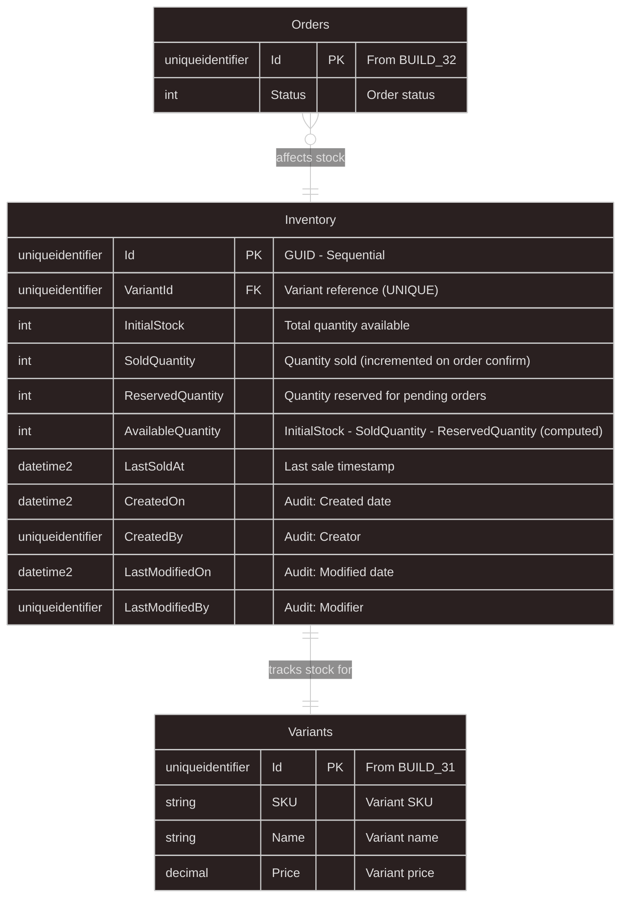

# BUILD_33: Database Design - Inventory Module (Single Table for Digital Products)

> 📚 [Quay lại Mục lục](BUILD_INDEX.md)  
> 📋 **Prerequisites:** BUILD_31 (Catalog Module), BUILD_32 (Order Module) đã complete  
> 🎯 **Approach:** Code-First với EF Core - **Single Table Design**
> 📦 **Features:** Ultra-Simple Stock Tracking for Digital Products  
> ⚠️ **Important:** One Table to Rule Them All  
> ⭐ **Design Philosophy:** **Maximum Simplicity** - Everything in one place

Tài liệu này hướng dẫn **thiết kế database cực đơn giản cho Inventory** - **CHỈ 1 BẢNG** cho sản phẩm số.

---

## 1. Overview

**Làm gì:** Thiết kế Inventory tracking với **1 bảng duy nhất** cho digital products.

**Tại sao cần:**
- **Ultra Simple:** Tất cả thông tin trong 1 bảng
- **Digital Products Only:** Courses, accounts, licenses
- **Easy Queries:** No JOINs needed
- **Maximum Performance:** Single table = fastest queries
- ⭐ **One Table:** Inventory table chứa tất cả

**Database Schema (SIÊU ĐƠN GIẢN):**
```
1 BẢNG DUY NHẤT:
└── Inventory (Variant tracking: InitialStock, Sold, Reserved, LastSold)
```

**Stock Formula (Trong 1 bảng):**
```
Inventory table columns:
├── VariantId (FK to Variants)
├── InitialStock (Tổng số lượng ban đầu)
├── SoldQuantity (Đã bán)
├── ReservedQuantity (Đang giữ cho orders pending)
├── AvailableQuantity (Computed: InitialStock - SoldQuantity - ReservedQuantity)
└── LastSoldAt (Timestamp cuối cùng bán)
```

**Why Single Table?**
- ✅ **Cực đơn giản:** Không cần JOIN
- ✅ **Dễ maintain:** Chỉ 1 bảng để quan tâm
- ✅ **Performance:** Fastest possible queries
- ✅ **Đủ dùng:** 100% đáp ứng nhu cầu digital products

---

## 1.1. Ultra-Simplified ERD (Single Table)



**Key Relationships:**
- ✅ **Inventory → Variants**: 1-to-1 (One inventory record per variant)
- ✅ **Orders → Inventory**: Many-to-1 (Orders affect inventory)

---

## 2. Single Inventory Entity ⭐⭐⭐

### 2.1. Inventory Entity (All-in-One)

**File:** `src/Core/Domain/Inventory/Inventory.cs`

```csharp
namespace ECO.WebApi.Domain.Inventory;

/// <summary>
/// Inventory tracking for digital products
/// Single table contains ALL stock information
/// </summary>
public class Inventory : AuditableEntity, IAggregateRoot
{
// ==================== Variant Reference (1-to-1) ====================
    
    /// <summary>
    /// Variant being tracked (UNIQUE constraint)
    /// </summary>
    public Guid VariantId { get; private set; }
    
    // ==================== Stock Tracking (All in one place) ⭐ ====================
    
/// <summary>
    /// Total initial stock (set by admin)
    /// For digital products: Can be very large (e.g., 10000 licenses)
    /// </summary>
    public int InitialStock { get; private set; }
    
    /// <summary>
    /// Total quantity sold (auto-incremented when order confirmed)
    /// </summary>
    public int SoldQuantity { get; private set; }
    
    /// <summary>
    /// Quantity reserved for pending orders
    /// Incremented when order created, decremented when confirmed/cancelled
    /// </summary>
    public int ReservedQuantity { get; private set; }
    
    /// <summary>
    /// Available for new orders = InitialStock - SoldQuantity - ReservedQuantity
    /// COMPUTED COLUMN (no storage)
    /// </summary>
    public int AvailableQuantity => InitialStock - SoldQuantity - ReservedQuantity;
 
    /// <summary>
    /// Last sale timestamp (for analytics)
    /// </summary>
    public DateTime? LastSoldAt { get; private set; }
    
    // ==================== Navigation Properties ====================
    
    public virtual Variant Variant { get; private set; } = default!;
    
    // ==================== Constructors ====================
  
    private Inventory() { }
    
    /// <summary>
/// Create inventory record for a variant
/// </summary>
    public Inventory(Guid variantId, int initialStock)
    {
        if (initialStock < 0)
      throw new ArgumentException("Initial stock cannot be negative", nameof(initialStock));
     
 VariantId = variantId;
   InitialStock = initialStock;
   SoldQuantity = 0;
        ReservedQuantity = 0;
     LastSoldAt = null;
    }
    
    // ==================== Stock Management Methods ⭐ ====================
    
    /// <summary>
    /// Update initial stock (admin function)
    /// </summary>
  public void SetInitialStock(int quantity)
    {
        if (quantity < 0)
            throw new ArgumentException("Initial stock cannot be negative", nameof(quantity));
        
        if (quantity < SoldQuantity)
   throw new InvalidOperationException($"Cannot set initial stock below sold quantity ({SoldQuantity})");
        
        InitialStock = quantity;
    }
    
  /// <summary>
    /// Reserve stock for order (when order created)
    /// </summary>
    public void ReserveStock(int quantity)
    {
  if (quantity <= 0)
throw new ArgumentException("Quantity must be positive", nameof(quantity));
        
        if (AvailableQuantity < quantity)
throw new InvalidOperationException($"Insufficient stock. Available: {AvailableQuantity}, Requested: {quantity}");
        ReservedQuantity += quantity;
    }
    
    /// <summary>
    /// Release reservation (order cancelled before payment)
    /// </summary>
public void ReleaseReservation(int quantity)
    {
    if (quantity <= 0)
            throw new ArgumentException("Quantity must be positive", nameof(quantity));
     
   if (ReservedQuantity < quantity)
   throw new InvalidOperationException($"Cannot release {quantity}, only {ReservedQuantity} reserved");
        
ReservedQuantity -= quantity;
    }
    
    /// <summary>
    /// Confirm sale (order payment successful)
    /// Convert reservation → sold
    /// </summary>
    public void ConfirmSale(int quantity)
    {
        if (quantity <= 0)
 throw new ArgumentException("Quantity must be positive", nameof(quantity));
        
        if (ReservedQuantity < quantity)
       throw new InvalidOperationException($"Cannot confirm {quantity}, only {ReservedQuantity} reserved");
  
        // Convert reserved → sold
     ReservedQuantity -= quantity;
        SoldQuantity += quantity;
        LastSoldAt = DateTime.UtcNow;
    }
    
    /// <summary>
  /// Refund sale (order cancelled/refunded after payment)
  /// Decrement sold, increase available
  /// </summary>
    public void RefundSale(int quantity)
    {
  if (quantity <= 0)
   throw new ArgumentException("Quantity must be positive", nameof(quantity));
        
  if (SoldQuantity < quantity)
            throw new InvalidOperationException($"Cannot refund {quantity}, only {SoldQuantity} sold");
      
      SoldQuantity -= quantity;
        // Stock becomes available again automatically (via AvailableQuantity computed property)
    }
    
    /// <summary>
    /// Check if enough stock available
    /// </summary>
    public bool HasAvailableStock(int requestedQuantity)
  {
        return AvailableQuantity >= requestedQuantity;
    }
}
```

**Key Points:**
- ✅ **ALL DATA IN ONE TABLE:** InitialStock, SoldQuantity, ReservedQuantity trong 1 bảng
- ✅ **No Complex Relations:** 1-to-1 với Variant
- ✅ **Simple Methods:** Reserve, Release, Confirm, Refund
- ✅ **Computed Property:** AvailableQuantity không lưu trong DB

---

## 3. Integration with Order Module (BUILD_32)

### 3.1. Order Workflow with Single Table

```csharp
// 1. When creating order from cart (BUILD_32)
public async Task<Guid> CreateOrderAsync(CreateOrderRequest request, CancellationToken ct)
{
    // ... existing order creation logic ...
    
    // ✅ Reserve stock for each item (SINGLE TABLE QUERY)
    foreach (var item in cart.CartItems)
    {
  var inventory = await _inventoryRepository
        .GetByVariantIdAsync(item.VariantId, ct);
  
        if (inventory == null)
            throw new NotFoundException($"Inventory not found for variant {item.VariantId}");
        
        // Check & reserve in ONE operation
inventory.ReserveStock(item.Quantity);
  }
    
    await _unitOfWork.SaveChangesAsync(ct);
  return order.Id;
}

// 2. When order confirmed (payment successful)
public async Task ConfirmOrderAsync(Guid orderId, CancellationToken ct)
{
var order = await _orderRepository.GetByIdAsync(orderId, ct);
    
    // Convert reservations → sales (SINGLE TABLE UPDATE)
    foreach (var orderItem in order.OrderItems)
 {
        var inventory = await _inventoryRepository
          .GetByVariantIdAsync(orderItem.VariantId, ct);
        
        // Reserved → Sold in ONE operation
        inventory.ConfirmSale(orderItem.Quantity);
    }
    
    await _unitOfWork.SaveChangesAsync(ct);
}

// 3. When order cancelled (before payment)
public async Task CancelOrderAsync(Guid orderId, CancellationToken ct)
{
    var order = await _orderRepository.GetByIdAsync(orderId, ct);
    
    // Release reservations (SINGLE TABLE UPDATE)
    foreach (var orderItem in order.OrderItems)
    {
        var inventory = await _inventoryRepository
            .GetByVariantIdAsync(orderItem.VariantId, ct);
        
        inventory.ReleaseReservation(orderItem.Quantity);
    }
    
    await _unitOfWork.SaveChangesAsync(ct);
}

// 4. When order refunded (after payment)
public async Task RefundOrderAsync(Guid orderId, CancellationToken ct)
{
    var order = await _orderRepository.GetByIdAsync(orderId, ct);

    // Refund sales (SINGLE TABLE UPDATE)
    foreach (var orderItem in order.OrderItems)
    {
        var inventory = await _inventoryRepository
       .GetByVariantIdAsync(orderItem.VariantId, ct);
        
      inventory.RefundSale(orderItem.Quantity);
    }
 
    await _unitOfWork.SaveChangesAsync(ct);
}
```

---

## 4. EF Core Configuration

### 4.1. InventoryConfiguration

**File:** `src/Infrastructure/Persistence/Configurations/Inventory/InventoryConfiguration.cs`

```csharp
using ECO.WebApi.Domain.Inventory;
using Microsoft.EntityFrameworkCore;
using Microsoft.EntityFrameworkCore.Metadata.Builders;

namespace ECO.WebApi.Infrastructure.Persistence.Configurations.Inventory;

public class InventoryConfiguration : IEntityTypeConfiguration<Inventory>
{
    public void Configure(EntityTypeBuilder<Inventory> builder)
  {
        builder.ToTable("Inventory", "Inventory");
        builder.HasKey(i => i.Id);
        
        // ✅ UNIQUE constraint: One inventory per variant
        builder.HasIndex(i => i.VariantId).IsUnique();
  
        // Properties
        builder.Property(i => i.InitialStock).IsRequired();
        builder.Property(i => i.SoldQuantity).IsRequired();
      builder.Property(i => i.ReservedQuantity).IsRequired();
        
        // ✅ Computed column (không lưu trong DB, tính runtime)
  builder.Ignore(i => i.AvailableQuantity);
        
   // Relationships
        builder.HasOne(i => i.Variant)
    .WithOne() // 1-to-1
            .HasForeignKey<Inventory>(i => i.VariantId)
            .OnDelete(DeleteBehavior.Cascade);
  
        // Indexes for queries
        builder.HasIndex(i => i.LastSoldAt);
   
        // Query filters
builder.HasQueryFilter(i => i.DeletedOn == null);
    }
}
```

---

## 5. Repository Interface

### 5.1. IInventoryRepository

**File:** `src/Core/Application/Common/Interfaces/IInventoryRepository.cs`

```csharp
namespace ECO.WebApi.Application.Common.Interfaces;

public interface IInventoryRepository : IRepository<Inventory>
{
    /// <summary>
    /// Get inventory by variant ID
    /// </summary>
    Task<Inventory?> GetByVariantIdAsync(Guid variantId, CancellationToken ct = default);
    
    /// <summary>
    /// Get low stock items (AvailableQuantity below threshold)
    /// </summary>
    Task<List<Inventory>> GetLowStockItemsAsync(int threshold, CancellationToken ct = default);
    
    /// <summary>
    /// Get best sellers (highest SoldQuantity)
    /// </summary>
    Task<List<Inventory>> GetBestSellersAsync(int count, CancellationToken ct = default);
}
```

---

## 6. Usage Examples

### 6.1. Create Inventory for Variant

```csharp
// When creating a new variant (from BUILD_31)
public async Task<Guid> CreateVariantAsync(CreateVariantRequest request, CancellationToken ct)
{
    // 1. Create variant (BUILD_31 logic)
    var variant = Variant.CreateSimple(
     productId: request.ProductId,
        sku: request.SKU,
        name: request.Name,
        price: request.Price,
        mainImage: request.MainImage
    );
    
    await _variantRepository.AddAsync(variant, ct);
 
    // 2. ✅ Create inventory record
  var inventory = new Inventory(
    variantId: variant.Id,
        initialStock: request.InitialStock ?? 0
    );
    
    await _inventoryRepository.AddAsync(inventory, ct);
    await _unitOfWork.SaveChangesAsync(ct);
    
    return variant.Id;
}
```

### 6.2. Check Stock Before Order

```csharp
public async Task<bool> CanFulfillOrderAsync(List<OrderItemDto> items, CancellationToken ct)
{
    foreach (var item in items)
    {
   var inventory = await _inventoryRepository
         .GetByVariantIdAsync(item.VariantId, ct);
  
   if (inventory == null || !inventory.HasAvailableStock(item.Quantity))
     {
            return false;
        }
    }
    
    return true;
}
```

### 6.3. Get Stock Report

```csharp
public async Task<List<StockReportDto>> GetStockReportAsync(CancellationToken ct)
{
    var inventories = await _inventoryRepository.ListAllAsync(ct);
    
    return inventories.Select(inv => new StockReportDto
    {
        VariantId = inv.VariantId,
   VariantName = inv.Variant.Name,
        InitialStock = inv.InitialStock,
        SoldQuantity = inv.SoldQuantity,
        ReservedQuantity = inv.ReservedQuantity,
AvailableQuantity = inv.AvailableQuantity, // Computed property
        LastSoldAt = inv.LastSoldAt
    }).ToList();
}
```

---

## 7. Analytics Queries (Single Table)

### 7.1. Best Sellers

```csharp
// Get top 10 best selling variants
var bestSellers = await _context.Inventory
    .Include(i => i.Variant)
    .OrderByDescending(i => i.SoldQuantity)
    .Take(10)
    .ToListAsync();
```

### 7.2. Low Stock Alert

```csharp
// Get variants with low stock (available < 10)
var lowStock = await _context.Inventory
    .Include(i => i.Variant)
    .Where(i => (i.InitialStock - i.SoldQuantity - i.ReservedQuantity) < 10)
    .ToListAsync();
```

### 7.3. Sales Summary

```csharp
// Total sales across all variants
var totalSales = await _context.Inventory
    .SumAsync(i => i.SoldQuantity);

var totalRevenue = await _context.Inventory
    .Include(i => i.Variant)
    .SumAsync(i => i.SoldQuantity * i.Variant.Price);
```

---

## 8. Summary

### ✅ BUILD_33 Complete Checklist (Ultra-Simplified):

**Single Table Design:**
- ✅ **Inventory table:** ALL stock data in one place
  - InitialStock
  - SoldQuantity
  - ReservedQuantity
  - AvailableQuantity (computed)
  - LastSoldAt

**Business Logic:**
- ✅ ReserveStock() - Hold stock for pending orders
- ✅ ReleaseReservation() - Free stock when order cancelled
- ✅ ConfirmSale() - Convert reservation → sold
- ✅ RefundSale() - Revert sold quantity

**Integration:**
- ✅ Works with BUILD_32 (Order module)
- ✅ 1-to-1 with Variants (BUILD_31)
- ✅ No complex JOINs needed

**Performance:**
- ✅ Single table = fastest queries
- ✅ No relationships to navigate
- ✅ Direct access to all data

**Perfect For:**
- ✅ Digital products (courses, accounts, licenses)
- ✅ No physical inventory needed
- ✅ Simple tracking only
- ✅ Maximum performance

---

**Quay lại:** [Mục lục](BUILD_INDEX.md)

---

**Document Version:** 2.0 (Single Table - Ultra-Simplified)  
**Last Updated:** 2025-02-01  
**Author:** ECO.WebApi Development Team  
**Status:** ✅ Production-Ready (Complete - No Part 2 Needed!)
