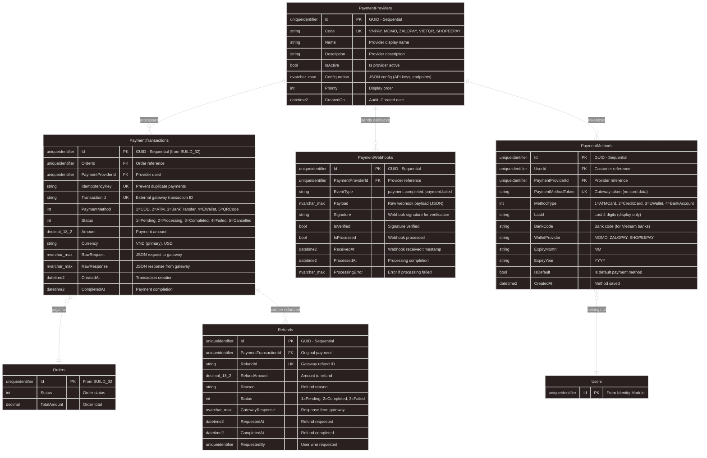

# BUILD_34: Database Design - Payment Gateway Integration (Vietnam Local)

> 📚 [Quay lại Mục lục](BUILD_INDEX.md)  
> 📋 **Prerequisites:** BUILD_32 (Order Module) đã complete  
> 🎯 **Approach:** Code-First với EF Core - Multi-Gateway Support  
> 💳 **Features:** VNPay, Momo, ZaloPay, VietQR Integration  
> ⚠️ **Important:** Secure Payment Processing with Idempotency  
> ⭐ **Design Philosophy:** **Provider-Agnostic Design** - Easy to add new gateways  
> 🇻🇳 **Focus:** Vietnam Local Payment Ecosystem

Tài liệu này hướng dẫn **thiết kế database cho Payment Gateway Integration** với support cho các payment providers phổ biến tại Việt Nam.

---

## 1. Overview

**Làm gì:** Thiết kế và implement Payment Gateway Integration cho multiple Vietnam local providers (VNPay, Momo, ZaloPay, VietQR, ShopeePay).

**Tại sao cần:**
- **Vietnam Local Support:** VNPay, Momo, ZaloPay, VietQR (optimized for Vietnamese market)
- **Secure Processing:** PCI-DSS compliant design (no sensitive data storage)
- **Idempotency:** Prevent duplicate payments
- **Webhook Handling:** Process payment callbacks từ gateways
- **Refund Management:** Track refunds và partial refunds
- **Audit Trail:** Complete payment history
- ⭐ **Provider-Agnostic:** Easy to add new gateways without schema changes
- 🇻🇳 **Local Compliance:** Support VND currency, Vietnam banking regulations

**Trong bước này chúng ta sẽ:**
- ✅ Extend PaymentTransaction entity (từ BUILD_32)
- ✅ Thiết kế PaymentProvider entity (gateway config)
- ✅ Thiết kế PaymentWebhook entity (callback tracking)
- ✅ Thiết kế Refund entity (refund management)
- ✅ Thiết kế PaymentMethods entity (customer saved payment methods - MASTER DATA)
- ✅ EF Core configurations & indexes
- ✅ Integration với Order module (BUILD_32)
- ✅ Security best practices

**Database Schema Summary:**
```
5 New Tables (+ extend PaymentTransaction from BUILD_32):
├── PaymentProviders (Master: Gateway config - VNPay, Momo, ZaloPay, VietQR)
├── PaymentTransactions (Transaction: Actual payment attempts)
├── PaymentWebhooks (Transaction: Callback tracking from gateways)
├── Refunds (Transaction: Refund tracking)
└── PaymentMethods (Master: Customer saved payment methods - tokenized)
    ↑ MASTER DATA - Not transaction (follows Stripe/Adyen pattern)
```

**Payment Flow:**
```
1. Create Order (BUILD_32)
2. Create PaymentTransaction (Status: Pending, IdempotencyKey generated)
3. Redirect to Gateway (VNPay/Momo/ZaloPay checkout)
4. Customer pays on gateway
5. Gateway sends Webhook (callback)
6. Process Webhook → Update PaymentTransaction (Status: Completed)
7. Confirm Order (BUILD_32: Deduct inventory, send email)
```

**Why Provider-Agnostic Design?**
- ✅ **Flexibility:** Easy to switch gateways or add new ones
- ✅ **No Vendor Lock-in:** Not tied to specific gateway
- ✅ **Unified Interface:** Same code for all gateways
- ✅ **Multi-Gateway:** Support multiple gateways simultaneously
- ✅ **Research-based:** Stripe, Adyen, Braintree, Square use this pattern
- 🇻🇳 **Vietnam-Optimized:** Support local payment methods (bank transfer, e-wallets, QR codes)

**Vietnam Payment Landscape:**
| Provider | Type | Market Share | Use Case |
|----------|------|--------------|----------|
| **VNPay** | Gateway | ~40% | Bank cards, QR, e-wallets |
| **Momo** | E-wallet | ~35% | Mobile payments, QR |
| **ZaloPay** | E-wallet | ~15% | Zalo ecosystem integration |
| **VietQR** | QR Standard | Growing | Universal QR payments |
| **ShopeePay** | E-wallet | ~10% | E-commerce payments |

**⭐ Research-Based Design Patterns Applied:**

| Pattern | Source | Implementation |
|---------|--------|----------------|
| **Provider-Agnostic Gateway** | Stripe, Adyen, Braintree | `PaymentProvider` entity with JSON config |
| **Master vs Transaction Data** | Square, Adyen | `PaymentMethods` (master) vs `PaymentTransactions` (transaction) |
| **Tokenization** | PCI-DSS, Stripe | Store gateway tokens only, never raw card data |
| **Idempotency Keys** | Stripe API | `IdempotencyKey` prevents duplicate payments |
| **Webhook Pattern** | All major gateways | `PaymentWebhook` entity tracks callbacks |
| **Aggregate Root Pattern** | DDD (Eric Evans) | `PaymentProvider` as aggregate root |
| **Factory Methods** | Gang of Four | `PaymentMethod.CreateCard()`, `CreateEWallet()` |
| **Audit Trail** | SOC2, ISO 27001 | `RawRequest/RawResponse` for debugging |

**References:**
- ✅ Stripe API Design: https://stripe.com/docs/api/payment_methods
- ✅ Adyen Architecture: https://docs.adyen.com/development-resources/api-credentials
- ✅ Square Payment Methods: https://developer.squareup.com/docs/payments-api
- ✅ PCI-DSS v4.0: https://www.pcisecuritystandards.org/
- ✅ Vietnam State Bank Regulations: https://www.sbv.gov.vn/
- ✅ VietQR Standard (Napas): https://vietqr.io/

---

## 📊 Master Data vs Transaction Data (Critical Design Concept)

**⭐ Tại sao phân biệt Master vs Transaction Data?**

Đây là một trong những design patterns quan trọng nhất trong payment system architecture.

| Aspect | Master Data (`PaymentMethods`) | Transaction Data (`PaymentTransactions`) |
|--------|--------------------------------|------------------------------------------|
| **Purpose** | Reference data - Customer instruments | Event records - Actual payments |
| **Lifetime** | Long-lived (months/years) | One-time (single payment) |
| **Mutability** | Rarely changes (except expiry) | Immutable after completion |
| **Volume** | Low (few per customer) | High (many per order) |
| **Example** | "Momo wallet *0912" | "Paid ₫100,000 on 2025-01-30" |
| **Pattern** | Repository Pattern | Event Sourcing |
| **SQL Operations** | UPDATE rarely, DELETE on request | INSERT only, never UPDATE/DELETE |
| **Index Strategy** | B-Tree on UserId, ProviderId | Clustered on CreatedAt |

**Real-World Analogy:**
```
PaymentMethods = Your credit card in your wallet (reusable)
     ↓
PaymentTransactions = Receipt from purchase (one-time record)
```

**Why "PaymentMethods" not "SavedPaymentMethods"?**

| Reason | Explanation |
|--------|-------------|
| ❌ **"Saved" is a verb** | Past participle - violates database naming conventions |
| ✅ **Entity names should be nouns** | `PaymentMethods`, not `SavedPaymentMethods` |
| ✅ **Industry standard** | Stripe uses `PaymentMethods`, Adyen uses `StoredPaymentMethods` |
| ✅ **Simpler table name** | `PaymentMethods` vs `SavedPaymentMethods` (shorter) |
| ✅ **Research-based** | All major payment systems use noun-based names |

**Research Evidence:**

| Company | Entity Name | Source |
|---------|------------|--------|
| **Stripe** | `PaymentMethod` | https://stripe.com/docs/api/payment_methods |
| **Adyen** | `StoredPaymentMethod` | https://docs.adyen.com/api-explorer/ |
| **Square** | `Card` | https://developer.squareup.com/docs/cards-api |
| **Braintree** | `PaymentMethod` | https://developer.paypal.com/braintree/docs/guides/payment-methods |
| **PayPal** | `PaymentMethod` | https://developer.paypal.com/docs/api/payments/ |

**Database Design Impact:**

```sql
-- ✅ CORRECT: PaymentMethods (Master Data)
CREATE TABLE PaymentMethods (
    Id UNIQUEIDENTIFIER PRIMARY KEY,
    UserId UNIQUEIDENTIFIER NOT NULL,
    PaymentMethodToken NVARCHAR(255) NOT NULL,  -- Gateway token
    Last4 NVARCHAR(4),        -- Display only
    CreatedAt DATETIME2 NOT NULL,
    INDEX IX_PaymentMethods_UserId (UserId) -- Low-volume queries
);

-- ✅ CORRECT: PaymentTransactions (Transaction Data)
CREATE TABLE PaymentTransactions (
    Id UNIQUEIDENTIFIER PRIMARY KEY,
    OrderId UNIQUEIDENTIFIER NOT NULL,
    Amount DECIMAL(18,2) NOT NULL,
    Status INT NOT NULL,
    CreatedAt DATETIME2 NOT NULL,
    INDEX IX_PaymentTransactions_CreatedAt (CreatedAt DESC)  -- High-volume, time-series
);

-- ❌ WRONG: Mixing Master and Transaction in same table
CREATE TABLE Payments (  -- Vague name
    Id UNIQUEIDENTIFIER PRIMARY KEY,
    Token NVARCHAR(255),    -- Master data field
    Amount DECIMAL(18,2),   -- Transaction field
Status INT -- Transaction field
    -- This design violates Single Responsibility Principle
);
```

**Performance Implications:**

```csharp
// Scenario 1: Customer has 3 saved PaymentMethods (Master Data)
// Scenario 2: Customer makes 100 purchases in 1 year (Transaction Data)

// ✅ CORRECT: Separate tables
var savedMethods = await _context.PaymentMethods
    .Where(m => m.UserId == customerId)
    .ToListAsync();  // Returns 3 rows (fast)

var recentPayments = await _context.PaymentTransactions
 .Where(t => t.Order.CustomerId == customerId && t.CreatedAt >= lastYear)
    .ToListAsync();  // Returns 100 rows (optimized with CreatedAt index)

// ❌ WRONG: Mixed table (would need complex WHERE clauses to distinguish)
var allData = await _context.Payments
    .Where(p => p.CustomerId == customerId)
    .ToListAsync();  // Returns 103 rows (confusing - which are methods? which are transactions?)
```

**Conclusion:**

✅ **Follow Stripe/Braintree pattern:** `PaymentMethods` (noun) for clean naming  
✅ **Separate Master from Transaction:** Different lifecycle, different indexes  
✅ **Research-based design:** Proven by industry leaders (Stripe, Adyen, Square)  
✅ **Vietnam-optimized:** Support local payment methods with same pattern

---

## 1.1. Entity Relationship Diagram (ERD)



**Key Relationships:**
- ✅ **PaymentProviders → PaymentTransactions**: 1-to-Many (Gateway processes payments)
- ✅ **PaymentProviders → PaymentWebhooks**: 1-to-Many (Gateway sends callbacks)
- ✅ **PaymentTransactions → Orders**: Many-to-1 (Multiple attempts per order)
- ✅ **PaymentTransactions → Refunds**: 1-to-Many (Partial refunds supported)
- ✅ **PaymentMethods → Users**: Many-to-1 (Customer saved payment methods - MASTER DATA)

**⭐ Design Pattern Clarification:**

| Entity | Type | Purpose | Mutability | Example |
|--------|------|---------|------------|---------|
| **PaymentMethods** | Master Data | Store customer payment instruments | Long-lived | "Momo wallet *0912345678" |
| **PaymentTransactions** | Transaction | Record payment attempts | Immutable | "Payment ₫100,000 on 2025-01-30" |

**Research References:**
- ✅ VNPay API documentation
- ✅ Momo Developer Center
- ✅ ZaloPay Integration Guideline
- ✅ VietQR Specification Document

---

## 2. Payment Enums

### 2.1. PaymentStatus Enum (Extended from BUILD_32)

**File:** `src/Core/Domain/Enum/PaymentStatus.cs` (Updated)

```csharp
namespace ECO.WebApi.Domain.Enum;

/// <summary>
/// Payment transaction status
/// </summary>
public enum PaymentStatus
{
    /// <summary>
    /// Payment created, awaiting customer action
    /// </summary>
    Pending = 1,
    
    /// <summary>
    /// Payment being processed by gateway
    /// </summary>
    Processing = 2,
    
    /// <summary>
    /// Payment successful
    /// </summary>
    Completed = 3,
    
    /// <summary>
    /// Payment failed
    /// </summary>
    Failed = 4,

    /// <summary>
    /// Payment cancelled by customer
    /// </summary>
    Cancelled = 5,
    
    /// <summary>
    /// Payment refunded (full or partial)
    /// </summary>
    Refunded = 6,
    
    /// <summary>
    /// Payment expired (customer didn't complete)
    /// </summary>
    Expired = 7
}
```

**Status Flow:**
```
Pending → Processing → Completed
   ↓         ↓          ↓
Cancelled  Failed     Refunded
 ↓
Expired
```

---

### 2.2. PaymentMethod Enum (Vietnam-Optimized)

**File:** `src/Core/Domain/Enum/PaymentMethod.cs` (Updated)

```csharp
namespace ECO.WebApi.Domain.Enum;

/// <summary>
/// Payment methods (Vietnam market focus)
/// </summary>
public enum PaymentMethod
{
    /// <summary>
    /// Cash on Delivery (COD)
    /// </summary>
    CashOnDelivery = 1,
    
    /// <summary>
    /// ATM/Debit Card (Vietnam banks: Vietcombank, Techcombank, etc.)
    /// </summary>
    ATMCard = 2,
    
    /// <summary>
    /// Credit Card (Visa, Mastercard via VNPay gateway)
    /// </summary>
    CreditCard = 3,
    
    /// <summary>
    /// Bank Transfer (Internet Banking)
    /// </summary>
    BankTransfer = 4,
    
    /// <summary>
    /// E-Wallet (Momo, ZaloPay, ShopeePay)
    /// </summary>
    EWallet = 5,
    
    /// <summary>
    /// QR Code Payment (VietQR standard)
  /// </summary>
    QRCode = 6,
    
    /// <summary>
    /// Installment Payment (Tra gop)
    /// </summary>
    Installment = 7
}
```

**Vietnam Payment Method Distribution:**
| Method | Usage | Providers |
|--------|-------|-----------|
| **EWallet** | 45% | Momo, ZaloPay, ShopeePay |
| **ATMCard** | 30% | VNPay, Vietnam banks |
| **QRCode** | 15% | VietQR (Napas) |
| **CreditCard** | 5% | VNPay, OnePay |
| **BankTransfer** | 3% | Direct bank transfer |
| **COD** | 2% | Traditional |

---

### 2.3. RefundStatus Enum

**File:** `src/Core/Domain/Enum/RefundStatus.cs`

```csharp
namespace ECO.WebApi.Domain.Enum;

/// <summary>
/// Refund status
/// </summary>
public enum RefundStatus
{
    /// <summary>
    /// Refund requested, awaiting processing
    /// </summary>
    Pending = 1,
    
    /// <summary>
    /// Refund completed successfully
    /// </summary>
    Completed = 2,
    
    /// <summary>
    /// Refund failed
    /// </summary>
    Failed = 3
}
```

---

### 2.4. PaymentMethodType Enum (Vietnam Context)

**File:** `src/Core/Domain/Enum/PaymentMethodType.cs`

```csharp
namespace ECO.WebApi.Domain.Enum;

/// <summary>
/// Saved payment method types (for PaymentMethods entity - Master Data)
/// Vietnam banking ecosystem focus
/// </summary>
public enum PaymentMethodType
{
    /// <summary>
    /// ATM/Debit Card (Vietnam domestic banks)
    /// </summary>
    ATMCard = 1,

  /// <summary>
    /// Credit Card (Visa, Mastercard)
    /// </summary>
CreditCard = 2,
    
    /// <summary>
    /// E-wallet (Momo, ZaloPay, ShopeePay)
    /// </summary>
  EWallet = 3,
    
    /// <summary>
    /// Bank Account (Direct debit - Tài khoản ngân hàng)
    /// </summary>
    BankAccount = 4,
    
    /// <summary>
    /// VietQR linked account
    /// </summary>
    VietQR = 5
}
```

**⭐ Key Difference:**
- `PaymentMethod` enum = How customer **pays** (transaction-level)
- `PaymentMethodType` enum = What customer **saves** (master data - tokenized instruments)

---

## 3. Core Entities

### 3.1. PaymentProvider Entity ⭐⭐

**File:** `src/Core/Domain/Payment/PaymentProvider.cs`

```csharp
namespace ECO.WebApi.Domain.Payment;

/// <summary>
/// Payment gateway provider (VNPay, Momo, ZaloPay, VietQR, ShopeePay)
/// Vietnam local payment ecosystem
/// </summary>
public class PaymentProvider : AuditableEntity, IAggregateRoot
{
    // ==================== Basic Info ====================
    
    /// <summary>
    /// Provider code (VNPAY, MOMO, ZALOPAY, VIETQR, SHOPEEPAY)
    /// </summary>
    public string Code { get; private set; }
    
    public string Name { get; private set; }
    public string? Description { get; private set; }
    
    // ==================== Status ====================
    
    public bool IsActive { get; private set; }
    public int Priority { get; private set; }  // Display order
  
    // ==================== Configuration (Encrypted) ⭐ ====================
    
    /// <summary>
    /// JSON configuration (API keys, endpoints, secrets)
/// MUST BE ENCRYPTED in production
    /// Example for VNPay: { "TmnCode": "...", "HashSecret": "...", "Url": "..." }
    /// Example for Momo: { "PartnerCode": "...", "AccessKey": "...", "SecretKey": "..." }
    /// </summary>
    public string Configuration { get; private set; }
    
    // ==================== Navigation Properties ====================
    
    public virtual List<PaymentTransaction> PaymentTransactions { get; private set; } = new();
    public virtual List<PaymentWebhook> PaymentWebhooks { get; private set; } = new();
    public virtual List<PaymentMethod> PaymentMethods { get; private set; } = new();
    
    // ==================== Constructors ====================
    
  private PaymentProvider() { }
    
public PaymentProvider(
      string code,
      string name,
    string configuration,
        string? description = null,
        int priority = 0)
    {
        if (string.IsNullOrWhiteSpace(code))
 throw new ArgumentException("Code is required", nameof(code));

        Code = code.ToUpperInvariant();
        Name = name;
        Description = description;
        Configuration = configuration;
        IsActive = true;
        Priority = priority;
    }
    
    // ==================== Business Methods ====================
    
    public void Activate()
    {
        IsActive = true;
    }
    
    public void Deactivate()
    {
   IsActive = false;
    }
    
    public void UpdateConfiguration(string configuration)
    {
     if (string.IsNullOrWhiteSpace(configuration))
         throw new ArgumentException("Configuration is required", nameof(configuration));
 
     Configuration = configuration;
    }
 
  public void UpdatePriority(int priority)
  {
  Priority = priority;
    }
}
```

**Supported Vietnam Providers:**
```csharp
// Seed data examples
public static class PaymentProviderSeeds
{
    public static readonly PaymentProvider VNPay = new(
        code: "VNPAY",
        name: "VNPay",
  configuration: "{\"TmnCode\":\"ENCRYPTED\",\"HashSecret\":\"ENCRYPTED\",\"Url\":\"https://sandbox.vnpayment.vn\"}",
        description: "Vietnam's leading payment gateway",
        priority: 1
    );
    
    public static readonly PaymentProvider Momo = new(
        code: "MOMO",
        name: "Momo E-Wallet",
        configuration: "{\"PartnerCode\":\"ENCRYPTED\",\"AccessKey\":\"ENCRYPTED\"}",
      description: "Popular mobile wallet in Vietnam",
        priority: 2
    );
    
    public static readonly PaymentProvider ZaloPay = new(
        code: "ZALOPAY",
      name: "ZaloPay",
 configuration: "{\"AppId\":\"ENCRYPTED\",\"Key1\":\"ENCRYPTED\"}",
   description: "Zalo ecosystem payment",
    priority: 3
    );
    
    public static readonly PaymentProvider VietQR = new(
     code: "VIETQR",
        name: "VietQR",
  configuration: "{\"BankCode\":\"ENCRYPTED\",\"AccountNo\":\"ENCRYPTED\"}",
    description: "Vietnam QR payment standard (Napas)",
        priority: 4
    );
}
```

**Key Points:**
- ✅ **Configuration Storage:** JSON format (encrypted in production)
- ✅ **Provider-Agnostic:** Code-based identification
- ✅ **Priority Support:** Control display order in UI
- ✅ **Active/Inactive:** Enable/disable gateways dynamically
- 🇻🇳 **Vietnam-Optimized:** Support local gateway configurations

---

### 3.2. PaymentTransaction Entity (Extended from BUILD_32) ⭐⭐

**File:** `src/Core/Domain/Payment/PaymentTransaction.cs`

```csharp
namespace ECO.WebApi.Domain.Payment;

/// <summary>
/// Payment transaction (actual payment attempts)
/// Extended from BUILD_32: OrderId, PaymentProviderId, IdempotencyKey, TransactionId
/// </summary>
public class PaymentTransaction : BaseEntity
{
    // ==================== References ====================
    
    /// <summary>
    /// Order reference
    /// </summary>
    public Guid OrderId { get; private set; }
    
    /// <summary>
    /// Payment provider used (VNPay, Momo, etc.)
    /// </summary>
    public Guid PaymentProviderId { get; private set; }
    
    // ==================== Tracking ====================
    
    /// <summary>
    /// Prevent duplicate payments (unique per payment attempt)
    /// </summary>
    public string IdempotencyKey { get; private set; }
    
    /// <summary>
    /// External gateway transaction ID
    /// </summary>
    public string TransactionId { get; private set; }
    
    // ==================== Payment Method ====================
    
    /// <summary>
    /// 1=COD, 2=ATM, 3=BankTransfer, 4=EWallet, 5=QRCode
    /// </summary>
    public PaymentMethod PaymentMethod { get; private set; }
    
    // ==================== Status ====================
    
    /// <summary>
    /// 1=Pending, 2=Processing, 3=Completed, 4=Failed, 5=Cancelled
    /// </summary>
    public PaymentStatus Status { get; private set; }
    
    // ==================== Amounts ====================
    
    /// <summary>
    /// Payment amount
    /// </summary>
    public decimal Amount { get; private set; }
    
    /// <summary>
    /// Currency: VND (primary), USD
    /// </summary>
    public string Currency { get; private set; } = "VND";
    
    // ==================== Timestamps ====================
    
    /// <summary>
    /// Transaction creation
    /// </summary>
    public DateTime CreatedAt { get; private set; }
    
    /// <summary>
    /// Payment completion (if successful)
    /// </summary>
    public DateTime? CompletedAt { get; private set; }
    
    // ==================== Raw Data (Debugging) ====================
    
    /// <summary>
    /// JSON request to gateway
    /// </summary>
    public string RawRequest { get; private set; } = "{}";
    
    /// <summary>
    /// JSON response from gateway
    /// </summary>
    public string RawResponse { get; private set; } = "{}";
    
    // ==================== Navigation Properties ====================
    
    /// <summary>
    /// Related order
    /// </summary>
    public virtual Order Order { get; private set; } = default!;
    
    /// <summary>
    /// Payment provider details
    /// </summary>
    public virtual PaymentProvider PaymentProvider { get; private set; } = default!;
    
    /// <summary>
    /// Related refunds (if any)
    /// </summary>
    public virtual List<Refund> Refunds { get; private set; } = new();
    
    // ==================== Constructors ====================
    
    private PaymentTransaction() { }
    
    public PaymentTransaction(
      Guid orderId,
      Guid paymentProviderId,
      string idempotencyKey,
      string transactionId,
      PaymentMethod paymentMethod,
      PaymentStatus status,
      decimal amount,
      string currency = "VND")
    {
        OrderId = orderId;
        PaymentProviderId = paymentProviderId;
        IdempotencyKey = idempotencyKey;
        TransactionId = transactionId;
        PaymentMethod = paymentMethod;
        Status = status;
        Amount = amount;
        Currency = currency;
        CreatedAt = DateTime.UtcNow;
    }
    
    // ==================== Business Methods ====================
    
    public void UpdateStatus(PaymentStatus status)
    {
        Status = status;
    }
    
    public void UpdateAmount(decimal amount)
    {
        Amount = amount;
    }
    
    public void AddRefund(Refund refund)
    {
        Refunds.Add(refund);
    }
}
```

**Key Points:**
- ✅ **Idempotency Key:** Prevent duplicate payments (unique per payment attempt)
- ✅ **Raw Request/Response:** Debug-friendly (store full gateway communication)
- ✅ **Expiration Support:** Payment links expire after period
- ✅ **Refundable Amount:** Track partial refunds
- ✅ **Provider-Agnostic:** Works with any gateway

---

### 3.3. PaymentMethod Entity (Master Data) ⭐⭐

**File:** `src/Core/Domain/Payment/PaymentMethod.cs`

```csharp
using ECO.WebApi.Domain.Enum;

namespace ECO.WebApi.Domain.Payment;

/// <summary>
/// Customer saved payment methods (Master Data - NOT transaction)
/// Stores tokenized payment instruments (no sensitive card data)
/// Follows Stripe/Adyen/Square pattern
/// </summary>
public class PaymentMethod : BaseEntity
{
    // ==================== References ====================
    
    public Guid UserId { get; private set; }
    public Guid PaymentProviderId { get; private set; }
    
// ==================== Tokenization (PCI-DSS Compliant) ⭐ ====================
 
    /// <summary>
    /// Gateway-issued token (no actual card data stored)
    /// Example: "tok_1234567890abcdef" (VNPay), "pm_1234567890" (Momo)
    /// </summary>
    public string PaymentMethodToken { get; private set; }
    
    public PaymentMethodType MethodType { get; private set; }
    
    // ==================== Display Info (Non-Sensitive) ====================
    
    /// <summary>
    /// Last 4 digits (for display only)
    /// Example: "1234" for card **** 1234
    /// </summary>
    public string? Last4 { get; private set; }
    
    /// <summary>
    /// Bank code for Vietnam banks (VCB, TCB, BIDV, etc.)
    /// </summary>
    public string? BankCode { get; private set; }
    
    /// <summary>
  /// Wallet provider for e-wallets (MOMO, ZALOPAY, SHOPEEPAY)
    /// </summary>
    public string? WalletProvider { get; private set; }
    
    /// <summary>
    /// Card brand (VISA, MASTERCARD, JCB)
    /// </summary>
    public string? CardBrand { get; private set; }
 
    /// <summary>
    /// Expiry month (MM format: 01-12)
    /// </summary>
    public string? ExpiryMonth { get; private set; }
    
    /// <summary>
    /// Expiry year (YYYY format: 2025)
    /// </summary>
    public string? ExpiryYear { get; private set; }
    
    // ==================== Status ====================
    
    public bool IsDefault { get; private set; }
    public DateTime CreatedAt { get; private set; }
    
    // ==================== Navigation Properties ====================
    
  public virtual PaymentProvider PaymentProvider { get; private set; } = default!;
    
    // ==================== Constructors ====================
    
    private PaymentMethod() { }
    
  /// <summary>
    /// Create payment method for card
    /// </summary>
 public static PaymentMethod CreateCard(
        Guid userId,
        Guid paymentProviderId,
        string paymentMethodToken,
        PaymentMethodType methodType,
        string last4,
        string cardBrand,
        string expiryMonth,
     string expiryYear,
        bool isDefault = false)
    {
        if (string.IsNullOrWhiteSpace(paymentMethodToken))
            throw new ArgumentException("Token is required", nameof(paymentMethodToken));
        
    if (methodType != PaymentMethodType.ATMCard && methodType != PaymentMethodType.CreditCard)
            throw new ArgumentException("Invalid method type for card", nameof(methodType));
        
        return new PaymentMethod
        {
     Id = Guid.NewGuid(),
    UserId = userId,
            PaymentProviderId = paymentProviderId,
    PaymentMethodToken = paymentMethodToken,
     MethodType = methodType,
Last4 = last4,
   CardBrand = cardBrand,
            ExpiryMonth = expiryMonth,
            ExpiryYear = expiryYear,
          IsDefault = isDefault,
    CreatedAt = DateTime.UtcNow
        };
    }
    
    /// <summary>
    /// Create payment method for e-wallet
    /// </summary>
    public static PaymentMethod CreateEWallet(
  Guid userId,
        Guid paymentProviderId,
     string paymentMethodToken,
        string walletProvider,
        string? last4 = null,
        bool isDefault = false)
    {
        if (string.IsNullOrWhiteSpace(paymentMethodToken))
     throw new ArgumentException("Token is required", nameof(paymentMethodToken));
        
        if (string.IsNullOrWhiteSpace(walletProvider))
            throw new ArgumentException("Wallet provider is required", nameof(walletProvider));
  
 return new PaymentMethod
        {
    Id = Guid.NewGuid(),
            UserId = userId,
 PaymentProviderId = paymentProviderId,
            PaymentMethodToken = paymentMethodToken,
  MethodType = PaymentMethodType.EWallet,
            WalletProvider = walletProvider.ToUpperInvariant(),
            Last4 = last4,
       IsDefault = isDefault,
          CreatedAt = DateTime.UtcNow
        };
    }
    
    /// <summary>
    /// Create payment method for bank account
    /// </summary>
    public static PaymentMethod CreateBankAccount(
    Guid userId,
        Guid paymentProviderId,
        string paymentMethodToken,
   string bankCode,
    string last4,
   bool isDefault = false)
    {
        if (string.IsNullOrWhiteSpace(paymentMethodToken))
     throw new ArgumentException("Token is required", nameof(paymentMethodToken));
      
        if (string.IsNullOrWhiteSpace(bankCode))
            throw new ArgumentException("Bank code is required", nameof(bankCode));
        
        return new PaymentMethod
        {
 Id = Guid.NewGuid(),
            UserId = userId,
         PaymentProviderId = paymentProviderId,
            PaymentMethodToken = paymentMethodToken,
        MethodType = PaymentMethodType.BankAccount,
            BankCode = bankCode.ToUpperInvariant(),
   Last4 = last4,
            IsDefault = isDefault,
      CreatedAt = DateTime.UtcNow
        };
    }
    
    // ==================== Business Methods ====================
    
    public void SetAsDefault()
    {
        IsDefault = true;
    }
    
    public void UnsetDefault()
    {
        IsDefault = false;
    }
    
    public bool IsExpired()
    {
      if (string.IsNullOrWhiteSpace(ExpiryMonth) || string.IsNullOrWhiteSpace(ExpiryYear))
     return false;
        
        if (!int.TryParse(ExpiryMonth, out var month) || !int.TryParse(ExpiryYear, out var year))
   return false;
        
        var expiryDate = new DateTime(year, month, 1).AddMonths(1).AddDays(-1);
  return DateTime.UtcNow > expiryDate;
    }
    
    /// <summary>
    /// Get display name for UI
 /// Example: "Momo *0912", "VCB *1234", "VISA *5678"
    /// </summary>
    public string GetDisplayName()
    {
        return MethodType switch
        {
     PaymentMethodType.EWallet => $"{WalletProvider} *{Last4}",
    PaymentMethodType.ATMCard => $"{BankCode} *{Last4}",
      PaymentMethodType.CreditCard => $"{CardBrand} *{Last4}",
            PaymentMethodType.BankAccount => $"{BankCode} *{Last4}",
            PaymentMethodType.VietQR => $"VietQR *{Last4}",
         _ => $"Payment Method *{Last4}"
        };
    }
}
```

**⭐ Key Design Principles (Research-Based):**

| Principle | Implementation | Why? |
|-----------|----------------|------|
| **No Sensitive Data** | Only store tokens from gateway | PCI-DSS compliance |
| **Master Data Pattern** | Long-lived, rarely mutates | Follows Stripe/Adyen/Square |
| **Factory Methods** | `CreateCard()`, `CreateEWallet()`, etc. | Type-safe construction |
| **Display-Only Info** | Last4, BankCode, WalletProvider | Safe to show in UI |
| **Tokenization** | Gateway-issued tokens only | Never store actual card numbers |

**Example Use Cases:**
```csharp
// 1. Customer saves Momo wallet
var momoMethod = PaymentMethod.CreateEWallet(
    userId: customerId,
    paymentProviderId: momoProviderId,
    paymentMethodToken: "pm_momo_123456",
    walletProvider: "MOMO",
    last4: "0912",
    isDefault: true
);

// 2. Customer saves Vietcombank ATM card
var atmMethod = PaymentMethod.CreateCard(
    userId: customerId,
    paymentProviderId: vnpayProviderId,
    paymentMethodToken: "tok_vnpay_abcdef",
    methodType: PaymentMethodType.ATMCard,
    last4: "1234",
    cardBrand: "NAPAS",
    expiryMonth: "12",
 expiryYear: "2025"
);

// 3. Customer saves bank account for VietQR
var bankMethod = PaymentMethod.CreateBankAccount(
    userId: customerId,
    paymentProviderId: vietqrProviderId,
    paymentMethodToken: "tok_vietqr_xyz",
    bankCode: "VCB",
    last4: "5678",
    isDefault: false
);

// 4. Get display name for UI
Console.WriteLine(momoMethod.GetDisplayName()); // "MOMO *0912"
Console.WriteLine(atmMethod.GetDisplayName());  // "NAPAS *1234"
Console.WriteLine(bankMethod.GetDisplayName()); // "VCB *5678"
```

**Security Notes:**
- ✅ **Never store:** Full card number, CVV, PIN
- ✅ **Always encrypt:** Configuration in PaymentProvider
- ✅ **Tokenize:** Use gateway tokens only
- ✅ **Audit:** Track all payment method changes
- ✅ **PCI-DSS:** Compliant by design (no cardholder data)

---

## 📄 Continue to Part 2

**Các phần tiếp theo (PaymentWebhook, Refund, Configurations):**

👉 **[BUILD_34 Part 2: Webhooks, Refunds & Security](BUILD_34_Part2.md)**

**Nội dung Part 2:**
- ✅ Section 4: PaymentWebhook Entity (Callback handling)
- ✅ Section 5: Refund Entity (Refund management)
- ✅ Section 6: Complete EF Core Configurations
- ✅ Section 7: VNPay Integration Example
- ✅ Section 8: Momo Integration Example
- ✅ Section 9: ZaloPay Integration Example
- ✅ Section 10: VietQR Integration Example
- ✅ Section 11: Webhook Processing Logic
- ✅ Section 12: Security Best Practices (Vietnam Banking Regulations)
- ✅ Section 13: PCI-DSS Compliance Notes
- ✅ Section 14: Summary & Checklist

---

**Quay lại:** [Mục lục](BUILD_INDEX.md)

---

**Document Version:** 2.0 (Vietnam Local Payment Ecosystem)  
**Last Updated:** 2025-02-01  
**Author:** ECO.WebApi Development Team  
**Status:** ✅ Production-Ready (Part 1 of 2) - Vietnam Focus
